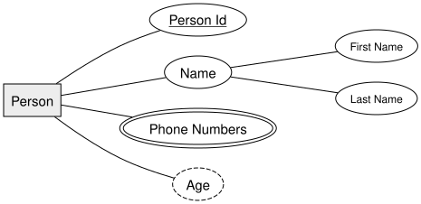
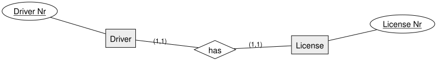
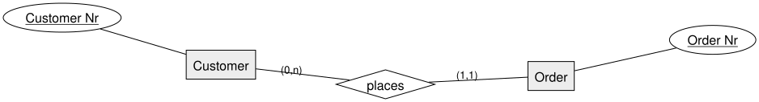
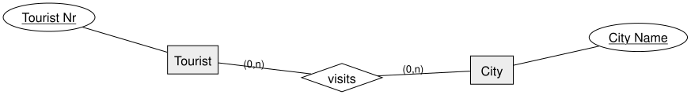

<!-- _class: lead -->

# ERM Fundamentals
## Chen Notation — DBI 3xHIF

---

## Agenda

1. From Tables to Entities
2. Entity, Relationship, Attribute
3. Attribute Types
4. Keys
5. Cardinality: 1:1, 1:n, n:m
6. Summary

---

## Learning Goals

- I can identify entities, relationships, and attributes in a scenario
- I can draw them using Chen notation (rectangle, diamond, oval)
- I can distinguish key, composite, multivalued, and derived attributes
- I can determine and notate 1:1, 1:n, and n:m cardinalities

---

## Recap: From Tables to Entities

Last lesson we turned a prose specification into plain tables by hand, and talked
about primary and foreign keys.

Today we give that process a **formal notation**: the **Entity-Relationship Model
(ERM)**, introduced by Peter Chen in 1976.

An ERM diagram describes the **static structure** of data — independent of any
specific database product.

---

## The Three Building Blocks

| Concept | Meaning | Notation |
|---|---|---|
| **Entity** | A distinguishable thing in the real world (Student, Car, Order) | Rectangle |
| **Relationship** | A meaningful association between entities (writes, supervises) | Diamond |
| **Attribute** | A property describing an entity or relationship (name, date) | Oval |

An **entity set** groups similar entities (all students); a single student is one *entity*.

---

## Example: Entity with Attributes

---

## Attribute Types

- **Key attribute** — uniquely identifies each entity → <u>underlined</u>
- **Composite attribute** — made up of smaller parts → `Name` splits into `First Name` / `Last Name`
- **Multivalued attribute** — an entity can have several values → double oval (`Phone Numbers`)
- **Derived attribute** — computed from other data, not stored → dashed oval (`Age` from birth date)

---

## Keys

- A **key** is a minimal set of attributes that uniquely identifies an entity
- An entity type can have several **key candidates** — one is chosen as the **primary key**, the rest are secondary keys
- Example: entity `City` — attributes `ZIP`, `Country`, `Population`, `Area Code` — both `ZIP` and `Area Code` could serve as a key

---

## Cardinality

Cardinality describes **how many** instances of one entity relate to instances of another, through a relationship.

Three basic shapes:

- **1:1** — one-to-one
- **1:n** — one-to-many
- **n:m** — many-to-many

---

## 1:1 — Driver has License

Each driver has exactly one license; each license belongs to exactly one driver.

---

## 1:n — Customer places Order

A customer can place many orders (or none); each order belongs to exactly one customer.

---

## n:m — Tourist visits City

A tourist visits many cities; a city is visited by many tourists.

---

<!-- _class: invert -->

## Summary

- **Entity** = rectangle · **Relationship** = diamond · **Attribute** = oval
- Attributes can be **key**, **composite**, **multivalued**, or **derived**
- Cardinality — **1:1**, **1:n**, **n:m** — describes how entities relate through a relationship
- You now have every building block needed to model your own scenario in Chen notation
