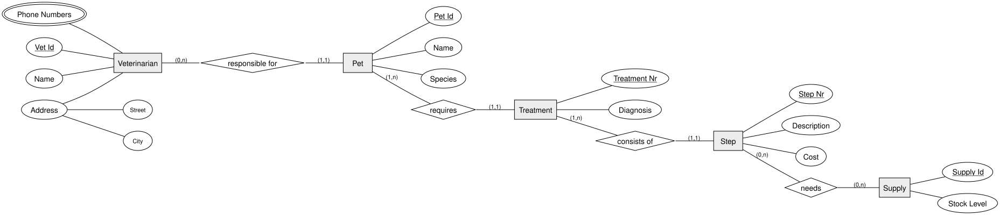

<!-- _class: lead -->

# Modeling a 1:n Chain
## DBI 3xHIF

---

## Agenda

1. Recap
2. Designing Around "No NULLs"
3. Worked Example: Veterinary Clinic
4. Reading the Full Diagram
5. Summary

---

## Learning Goals

- I can model a chain of 1:n relationships across several entities
- I can decide when a composite or multivalued attribute needs its own entity instead
- I can avoid NULL-prone columns by decomposing correctly

---

## Recap

We know entities, relationships, attributes, and cardinality. Today: put all of it
together into one bigger, connected diagram.

---

## Designing Around "No NULLs"

A well-designed model tries to avoid columns that are **often empty**.

- A **multivalued** attribute (several phone numbers) shouldn't become `phone1`,
  `phone2`, `phone3` columns — most rows would leave `phone3` empty
- If something only applies to *some* entities of a type, it likely belongs in its
  **own entity**, linked by a relationship, instead of a nullable column

---

## Worked Example: Veterinary Clinic

A veterinary clinic wants to track:

- **Veterinarians**, each responsible for several **pets** (a pet has exactly one responsible vet)
- Each **pet** requires one or more **treatments**
- Each **treatment** consists of one or more **steps**
- Each **step** may need one or more **supplies** (and a supply can be used across many steps)

---

## Reading the Full Diagram

Follow the chain left to right: `Veterinarian → Pet → Treatment → Step → Supply`.
Note `Address` (composite) and `Phone Numbers` (multivalued) on `Veterinarian`.

---

<!-- _class: invert -->

## Summary

- A full ERD is just several relationships **chained together**
- Composite and multivalued attributes should be modeled explicitly, not as extra nullable columns
- Read a chained diagram one relationship at a time
