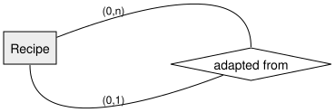
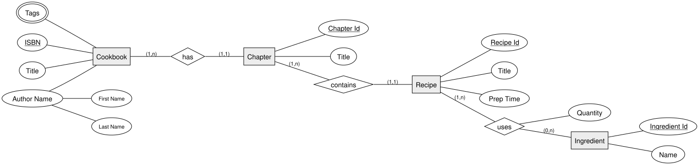

<!-- _class: lead -->

# 1:n, n:m & Composite Keys
## DBI 3xHIF

---

## Agenda

1. Recap
2. n:m Relationships with Their Own Attributes
3. Recursive (Self-Referencing) Relationships
4. Worked Example: Cookbook Collection
5. Summary

---

## Learning Goals

- I can model an n:m relationship that itself carries an attribute
- I can model a relationship from an entity type back to itself
- I can combine 1:n chains, n:m relationships, composite and multivalued attributes in one diagram

---

## Recap

We've chained 1:n relationships together (`Veterinarian → Pet → Treatment → ...`).
Today we add two more building blocks: **n:m relationships with attributes**, and
**relationships that loop back to the same entity**.

---

## n:m Relationships with Their Own Attributes

An n:m relationship can carry its **own attribute** — one that only makes sense for
the *combination* of both entities, not for either one alone.

Example: `Student` **attends** `Course` — the attribute `Grade` belongs to that
specific student-course combination, not to the student or the course alone.

---

## Recursive (Self-Referencing) Relationships

Sometimes an entity type relates to **itself**.

A recipe can be an adaptation of another recipe — both roles are the same entity type
(`Recipe`), so the relationship loops back onto it.

---

## Worked Example: Cookbook Collection

A cookbook app tracks:

- **Cookbooks** (ISBN, title, author name, tags) containing several **chapters**
- Each **chapter** contains several **recipes**
- Each **recipe** uses one or more **ingredients**, each with a required **quantity**
- A **recipe** may be adapted from another recipe

---

## Full Diagram

`Author Name` is composite (first/last), `Tags` is multivalued, `Quantity` belongs to
the `uses` relationship itself.

---

<!-- _class: invert -->

## Summary

- n:m relationships can carry **their own attributes**
- A **recursive relationship** connects an entity type back to itself
- A real model usually combines several of these building blocks at once
