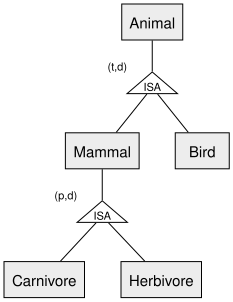
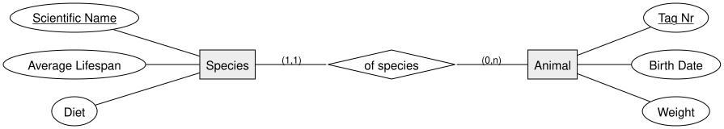

<!-- _class: lead -->

# IS-A Relationships & Min-Max Notation
## DBI 3xHIF

---

## Agenda

1. Recap
2. Min-Max Notation
3. IS-A / Generalization-Specialization
4. Total vs. Partial, Disjoint vs. Non-Disjoint
5. Worked Example: Zoo Animals
6. Instance vs. Type Attributes
7. Summary

---

## Learning Goals

- I can read and write (min,max) cardinality pairs
- I can model a generalization/specialization hierarchy using ISA notation
- I can classify a specialization as total/partial and disjoint/non-disjoint
- I can distinguish attributes that describe an individual instance from attributes that describe its type

---

## Recap

So far we labeled relationships with **1:1**, **1:n**, or **n:m** — good for a quick
overview, but it doesn't say **exactly how many**.

Today: a more precise notation, plus a new tool for modeling "is a kind of"
relationships between entities.

---

## Min-Max Notation

A **(min,max)** pair is placed on the edge next to each entity. It states: *how many
relationship instances does one entity instance participate in, at minimum and at
maximum?*

- Near **Student**: `(1,1)` — every student attends **exactly one** class
- Near **Class**: `(17,36)` — every class has **between 17 and 36** students

---

## Min-Max vs. 1:1 / 1:n / n:m

| Classic | Min-Max | Meaning |
|---|---|---|
| 1:1 | (1,1) / (1,1) | exactly one on both sides |
| 1:n | (0,1) / (0,n) | optional on one side, many on the other |
| n:m | (0,n) / (0,m) | many on both sides |

Min-max is **strictly more expressive** — it can say "at least 17, at most 36",
something 1:n alone cannot.

---

## IS-A / Generalization-Specialization

An **ISA relationship** models "is a kind of": a **superclass** groups common
attributes; **subclasses** add their own attributes and **inherit** everything from
the superclass.

- Notation: a triangle labeled **ISA**, superclass above, subclasses below
- Every subclass entity **is also** a superclass entity — attributes are shared, not duplicated

---

## Total vs. Partial, Disjoint vs. Non-Disjoint

Two independent questions for every ISA relationship:

- **Total (t)** — every superclass instance belongs to *at least one* subclass
  **Partial (p)** — some superclass instances belong to *no* subclass
- **Disjoint (d)** — an instance belongs to *at most one* subclass
  **Non-disjoint (nd)** — an instance may belong to *several* subclasses at once

---

## Worked Example: Zoo Animals

- `Animal` → `Mammal`/`Bird` — **(t,d)**: every recorded animal is a mammal or a bird, never both
- `Mammal` → `Carnivore`/`Herbivore` — **(p,d)**: not every mammal is classified further, and never both

---

## Instance vs. Type Attributes

Not every "kind of" split is an ISA relationship. Some attributes describe a **type**
shared by many instances, others describe **one specific instance**.

All lions share the same average lifespan and diet as their species — but each
individual animal has its own tag number, birth date, and weight.

---

<!-- _class: invert -->

## Summary

- **(min,max)** notation is more precise than 1:1/1:n/n:m
- **ISA** models generalization/specialization: triangle, superclass above, subclasses below
- Every ISA is **total or partial**, and **disjoint or non-disjoint**
- Not every split is ISA — sometimes it's a **type vs. instance** relationship instead
