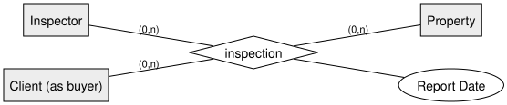
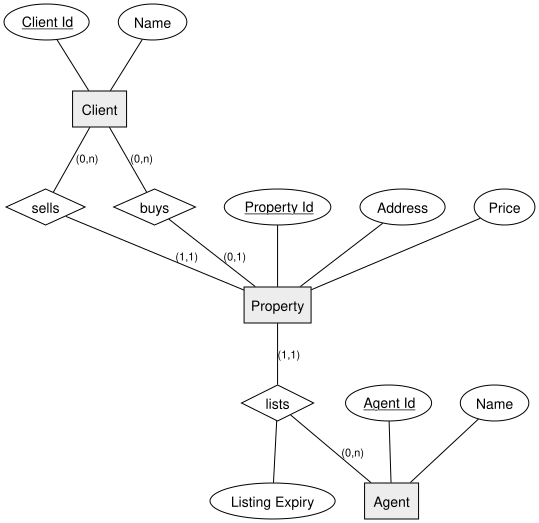

<!-- _class: lead -->

# Min-Max Notation: Roles & Multi-Participant Relationships
## DBI 3xHIF

---

## Agenda

1. Recap
2. Roles: One Entity, Several Relationships
3. Relationship Attributes with a Time Window
4. Ternary Relationships
5. Worked Example: Real Estate Agency
6. Summary

---

## Learning Goals

- I can model the same entity type playing several different roles toward another entity
- I can attach a time-boxed attribute to a relationship
- I can model a relationship connecting three entity types at once

---

## Recap

We introduced (min,max) notation in an earlier lesson. Today we go deeper: precise
cardinalities for **roles**, **time-boxed attributes**, and relationships with **more
than two** participants.

---

## Roles: One Entity, Several Relationships

The same entity type can relate to another entity type in **more than one way**, each
with its own name and cardinality.

Example: a `Client` can both **sell** and **buy** a `Property` — two separate
relationships between the same two entity types, each needing its own diamond.

---

## Relationship Attributes with a Time Window

An attribute on a relationship can describe **when** it's valid — not just *that* it
exists.

Example: an agent's `lists` relationship to a property can carry a `Listing Expiry`
date, so we know how long that listing is valid.

---

## Ternary Relationships

A relationship isn't limited to two entity types — it can connect **three or more**.

All three participants (and the `Report Date` attribute) belong to the **same**
relationship instance — this isn't the same as three separate binary relationships.

---

## Worked Example: Real Estate Agency

- A **client** can **sell** a property (0,n) and separately **buy** a property (0,n) — same entity, two roles
- Each **property** is **listed** by exactly one **agent**, with a `Listing Expiry` date
- An **inspection** connects an **inspector**, a **property**, and a **buying client** all at once

---

## Diagram: Roles & Listing

---

<!-- _class: invert -->

## Summary

- The same entity type can play **multiple roles** toward another entity — model each as its own relationship
- Relationship attributes can describe a **time window** (e.g. an expiry date)
- A **ternary relationship** connects three (or more) entity types in a single relationship instance
