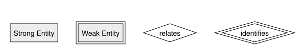
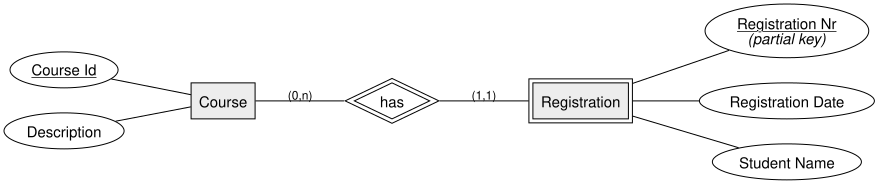
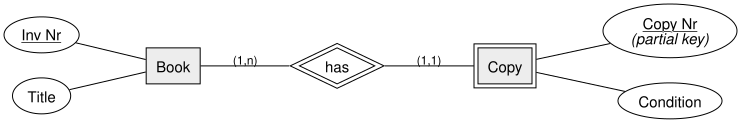

<!-- _class: lead -->

# Weak Entities
## DBI 3xHIF

---

## Agenda

1. Recap: Keys So Far
2. The Problem: Entities Without Their Own Key
3. Weak Entity Notation
4. Example: Course & Registration
5. Example: Book & Copy
6. Summary

---

## Learning Goals

- I can recognize when an entity cannot be identified by its own attributes
- I can draw a weak entity and its identifying relationship in Chen notation
- I can explain why a weak entity's key is composed of a partial key plus the owner's key

---

## Recap: Keys So Far

Every entity we modeled so far had **its own key attribute** — one or more attributes
that, by themselves, uniquely identify each entity: `Student Id`, `Thesis Nr`,
`Inv Nr`, ...

But not every entity works that way.

---

## The Problem

Some entities **cannot be uniquely identified by their own attributes alone**.

Example: a course `registration` — its own attributes (`registration date`, `student
name`) don't uniquely identify it. Two students could register on the same day. A
registration only makes sense **in the context of a specific course**.

Such an entity is called a **weak entity**; the entity it depends on is its **owner**
(or **identifying**) entity.

---

## Weak Entity Notation

- **Weak entity** → double rectangle
- **Identifying relationship** → double diamond
- The weak entity's own (incomplete) identifier is called a **partial key**

---

## The Composite Key Rule

A weak entity's real primary key = **partial key** (its own attribute) **+** the
**owner's primary key**.

- A weak entity always participates in its identifying relationship with cardinality
  **(1,1)** — it cannot exist without exactly one owner
- The owner side is typically **(0,n)** or **(1,n)** — one owner can have many
  dependent weak entities

---

## Example: Course & Registration

`Registration Nr` alone is only a **partial key** — the real key is
`(Course Id, Registration Nr)`.

---

## Example: Book & Copy

A library owns several physical **copies** of the same book. A copy only exists
because a book exists — if the book record is removed, all its copies go with it.
Real key: `(Inv Nr, Copy Nr)`.

---

<!-- _class: invert -->

## Summary

- A **weak entity** has no key attribute of its own that uniquely identifies it
- It is identified via a **partial key** + the **owner's primary key**
- Notation: **double rectangle** (weak entity), **double diamond** (identifying relationship)
- The weak entity always has cardinality **(1,1)** toward its owner — it cannot exist without it
