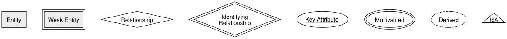

<!-- _class: lead -->

# Real-World Application
## Equipment Rental — DBI 3xHIF

---

## Agenda

1. Recap: Your Notation Toolkit
2. Today's Task
3. How to Approach It
4. Deliverable
5. Summary

---

## Learning Goals

- I can apply everything learned so far to a real, unfamiliar system
- I can derive an ERD from a website without being handed a specification

---

## Recap: Your Notation Toolkit

Plus: composite, key, and multivalued attributes, cardinality as (min,max), and roles —
everything from the last several lessons.

---

## Today's Task

So far, every exercise gave you a **written specification** to translate into a model.

Today there is no specification — only a **real website**. You'll have to figure out
the data model yourself, the way you would on a real project.

---

## How to Approach It

1. Browse the site like a customer would — note every **kind of thing** it manages
2. For each kind of thing, list its likely **attributes**
3. Look for **relationships** between them, and assign a **cardinality** to each
4. Watch for special cases: does anything look like a **weak entity**? An **ISA**
   hierarchy? A **recursive** relationship?
5. Draw the full ERD in Chen notation

---

## Deliverable

- A complete ERD (Chen notation) for the site's core rental process
- Be ready to justify your cardinality choices — there's often more than one
  reasonable answer, as long as you can explain your reasoning

---

<!-- _class: invert -->

## Summary

- You now have every tool needed to model a real, unfamiliar system from scratch
- Reverse-engineering starts the same way as any other modeling task: find the things, their properties, and how they relate
