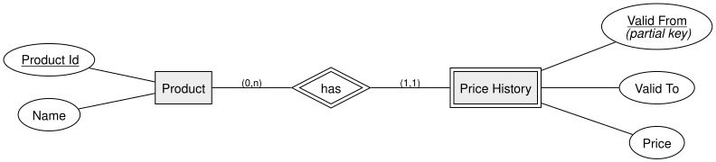
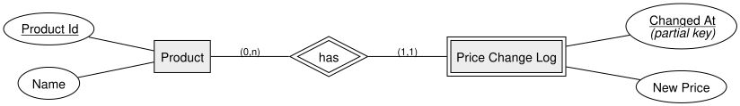

<!-- _class: lead -->

# Historization
## DBI 3xHIF

---

## Agenda

1. Recap
2. Why Historize Data?
3. Valid-Time vs. Transaction-Time
4. Pattern 1: From-To
5. Pattern 2: Log
6. Summary

---

## Learning Goals

- I can explain why some data needs to keep its history
- I can distinguish valid-time from transaction-time
- I can model both the From-To pattern and the Log pattern

---

## Recap

So far, our models describe the **current** state of things. But some facts change
over time, and we sometimes need to reconstruct what was true **in the past**.

---

## Why Historize Data?

**Historization** means recording how a value changed over time, instead of just
overwriting it.

Without it, updating a value **destroys** the old one — but audits, reports, and
"what was the price last month?" questions all need that old value back.

---

## Valid-Time vs. Transaction-Time

- **Valid time** — the period during which a fact was **true in the real world**
  (e.g. "this price applied from March to June")
- **Transaction time** — the moment we **recorded** that fact in the database

They often differ: we might enter a price change today that took effect last week.

---

## Pattern 1: From-To

Store each value together with the **period** it was valid for.

Querying "what was the price on date X?" means finding the row where
`Valid From ≤ X ≤ Valid To`.

---

## Pattern 2: Log

Store just a **timestamp** and the new value, every time something changes.

The value valid "as of" a given moment is the **latest logged row** before that moment
— simpler to write, slightly more work to query.

---

<!-- _class: invert -->

## Summary

- Historization keeps old values instead of overwriting them
- **Valid time** (when it was true) and **transaction time** (when we recorded it) can differ
- **From-To** stores an explicit validity period; **Log** stores one timestamp per change
