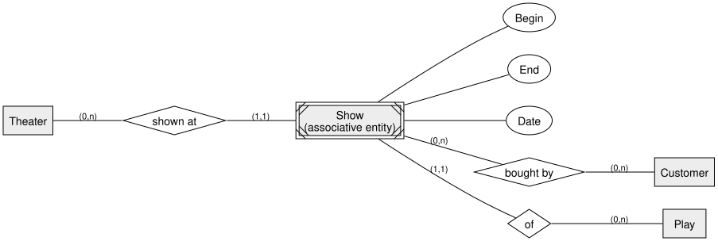
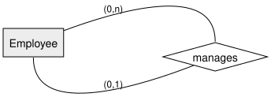

<!-- _class: lead -->

# Associative Entities, Recursive Relationships & the 3-Layer Architecture
## DBI 3xHIF

---

## Agenda

1. Associative Entity Sets
2. Recursive Relationships
3. The ANSI/SPARC 3-Layer Architecture
4. Summary

---

## Learning Goals

- I can recognize when a relationship needs to become an associative entity
- I can model a recursive (self-referencing) relationship with roles
- I can explain the three ANSI/SPARC layers and why they're kept independent

---

## The Problem: A Plain n:m Relationship

This tells us *that* a theater plays a play — but not **when**, and it gives us no way
to sell tickets to one specific **performance**.

---

## The Fix: An Associative Entity Set

Sometimes a relationship needs its **own identity** — attributes, and other entities
relating to *it specifically*, not to either side alone.

We merge the relationship and a new entity into one **associative entity set**: it
behaves as an entity (has its own attributes, other things relate to it) *and* still
represents the original relationship.

---

## Associative Entity: Result

`Show` now carries `Begin`/`Date`/`End`, and customers buy tickets to a **specific
show** — not to the theater or the play in the abstract.

---

## Recursive Relationships

An entity type can relate to **itself** — each side of the relationship plays a
different **role**.

One employee (the *manager*) manages zero or more employees; one employee (the
*subordinate*) has at most one manager.

---

## The ANSI/SPARC 3-Layer Architecture

A database is described at **three levels**, each hiding the details of the one below it:

- **External** — one schema per user/application, showing only what they need
- **Conceptual** — a single shared schema describing all the data and its structure
- **Internal** — how the data is actually stored (files, indexes, ...)

---

## Three Layers, One Entity

- **Logical independence** — the conceptual schema can change without breaking external views
- **Physical independence** — storage can change without touching the conceptual schema

---

<!-- _class: invert -->

## Summary

- An **associative entity set** merges a relationship and an entity when the relationship needs its own identity or attributes
- A **recursive relationship** connects an entity type to itself, using roles on each side
- The **3-layer architecture** separates external views, the conceptual schema, and physical storage — each independent of the others
