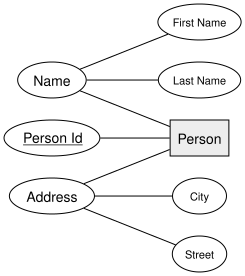
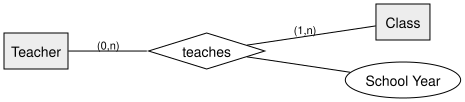

<!-- _class: lead -->

# Transforming ERM into a Relational Model
## DBI 3xHIF

---

## Agenda

1. The General Algorithm
2. Rule: Composite Attributes
3. Rule: Multivalued Attributes
4. Rule: 1:1 Relationships
5. Rule: 1:n Relationships
6. Rule: n:m Relationships
7. Summary

---

## Learning Goals

- I can apply the standard algorithm for transforming an ERM into relational tables
- I can transform composite and multivalued attributes correctly
- I can decide, for 1:1, 1:n, and n:m relationships, whether a foreign key or a new table is needed

---

## The General Algorithm

1. Reduce every attribute to **1NF** — flatten composite attributes, move multivalued attributes into their own table
2. Every **entity type** becomes its own table
3. Every **relationship type** becomes its own table — **except** binary 1:1 and 1:n relationships, where a foreign key is folded into an existing table instead

---

## Rule: Composite Attributes

A composite attribute is simply **flattened**: each of its parts becomes its own column.

---

## Rule: Composite Attributes — Result

| p_person |
|---|
| **Person Id** (PK) |
| First Name |
| Last Name |
| Street |
| City |

---

## Rule: Multivalued Attributes

A multivalued attribute **cannot** become a column — it becomes its own table, linked
back by a foreign key.

| t_phone_numbers |
|---|
| **Person Id** (PK, FK) |
| **Phone Number** (PK) |

---

## Rule: 1:1 Relationships

Fold the foreign key into the side with the **more restrictive** cardinality — here,
a class has at most one rep, so the FK goes on `Class`, with a unique constraint.

| k_class |
|---|
| **Class Id** (PK) |
| ... |
| Class Rep Student Id (FK, unique, nullable) |

---

## Rule: 1:n Relationships

Fold the foreign key into the **"many"** side — every student attends exactly one
class, so `Student` gets the FK, and it can't be NULL.

| s_student |
|---|
| **Student Id** (PK) |
| ... |
| Class Id (FK, not null) |

---

## Rule: n:m Relationships

Neither side can hold the FK alone — an n:m relationship always becomes its **own**
junction table, carrying both foreign keys (and any relationship attribute).

| u_teaches |
|---|
| **Teacher Id** (PK, FK) |
| **Class Id** (PK, FK) |
| **School Year** (PK) |

---

<!-- _class: invert -->

## Summary

- Reduce to 1NF first: flatten **composite** attributes, move **multivalued** attributes to their own table
- **1:1** and **1:n** relationships fold into a foreign key — **n:m** relationships always get their own table
- Every entity type becomes a table; only relationship tables can sometimes be avoided
