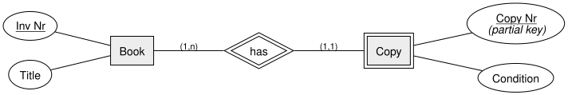
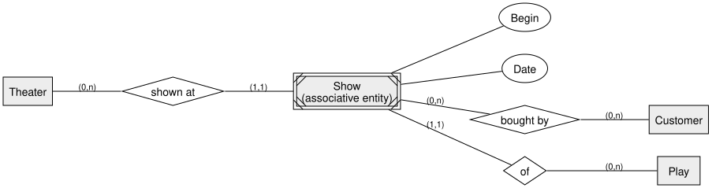
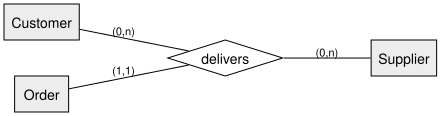

<!-- _class: lead -->

# Transforming EER into a Relational Model
## DBI 3xHIF

---

## Agenda

1. Recap
2. Rule: Weak Entities
3. Rule: Associative Entity Sets
4. Rule: Ternary Relationships
5. A First Look at IS-A
6. Summary

---

## Learning Goals

- I can transform a weak entity into a table with a correct key
- I can transform an associative entity set, introducing a surrogate key where needed
- I can transform a ternary relationship into a junction table

---

## Recap

We already transform entities, binary relationships, and their attributes into
tables. Today: three EER constructs that need a bit more care.

---

## Rule: Weak Entities

The weak entity's table gets a **composite key**: its own partial key **plus** the
owner's primary key (as a foreign key).

| e_copy |
|---|
| **Inv Nr** (PK, FK) |
| **Copy Nr** (PK) |
| Condition |

*(Alternative: give `Copy` its own surrogate key instead, with `Inv Nr` as a plain, not-null FK.)*

---

## Rule: Associative Entity Sets

`Show`'s "natural" key would be `(Theater Id, Play Id, Begin, Date)` — awkward to
reference from `Ticket Purchase`. We introduce a **surrogate key** instead.

---

## Associative Entity: Result

| t_show |
|---|
| **Show Id** (PK) |
| Theater Id (FK) |
| Play Id (FK) |
| Begin |
| Date |

| tp_ticket_purchase |
|---|
| **Show Id** (PK, FK) |
| **Customer Id** (PK, FK) |

---

## Rule: Ternary Relationships

A relationship with three participants becomes **one** junction table with **three**
foreign keys.

| li_delivery |
|---|
| **Customer Id** (FK) |
| **Supplier Id** (FK) |
| **Order Id** (PK, FK) |

---

## A First Look at IS-A

Transforming an ISA hierarchy needs its own set of rules — covered in full next
lesson. For now, the key idea: a subclass table's primary key is **also** a foreign
key referencing the superclass table (an **inclusion dependency**):

`Pilot[Employee Id] ⊆ Employee[Employee Id]`

---

<!-- _class: invert -->

## Summary

- A **weak entity** gets a composite key: partial key + owner's PK (or its own surrogate key)
- An **associative entity set** often needs a **surrogate key** once its natural key becomes awkward
- A **ternary relationship** becomes one junction table with three foreign keys
