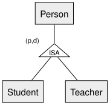

<!-- _class: lead -->

# IS-A Mapping Strategies
## Identity, Rollup, Rolldown — DBI 3xHIF

---

## Agenda

1. Recap
2. Strategy 1: Identity (Direct Mapping)
3. Strategy 2: Rollup
4. Strategy 3: Rolldown
5. Choosing a Strategy
6. Summary

---

## Learning Goals

- I can apply all three strategies for mapping an ISA hierarchy to tables
- I can explain the tradeoffs between them
- I can decide which strategy is (in)valid for a given total/partial, disjoint/non-disjoint combination

---

## Recap

Worked example for today: `Person` → `Student`/`Teacher`, **partial** (not every person
is a student or teacher) and **disjoint** (nobody is both).

---

## Strategy 1: Identity (Direct Mapping)

One table **per entity**, including the superclass. Each subclass table's primary key
is **also a foreign key** referencing the superclass.

| person | student | teacher |
|---|---|---|
| **Person Id** (PK) | **Person Id** (PK, FK) | **Person Id** (PK, FK) |
| Name | Class | Subject |

Always valid — works regardless of total/partial or disjoint/non-disjoint.

---

## Strategy 2: Rollup

**One** table for everything. Subclass-specific columns become **nullable**, plus a
discriminator column to say which subclass a row belongs to.

| person |
|---|
| **Person Id** (PK) |
| Name |
| Type (`'student'` / `'teacher'` / `NULL`) |
| Class *(nullable)* |
| Subject *(nullable)* |

Works for both total/partial — but only cleanly for **disjoint** hierarchies.

---

## Strategy 3: Rolldown

**Two** tables — merge the superclass's attributes directly **into each subclass**
table, and drop the superclass table entirely.

| student | teacher |
|---|---|
| **Person Id** (PK) | **Person Id** (PK) |
| Name | Name |
| Class | Subject |

Only valid if the specialization is **total** — otherwise, a plain `Person` who is
neither a student nor a teacher has **nowhere to be stored**.

---

## Choosing a Strategy

For our `Person → Student/Teacher` example (**partial**, disjoint):

- ✅ **Identity** — always safe
- ✅ **Rollup** — fine, since it's disjoint
- ❌ **Rolldown** — would **lose** any person who is neither a student nor a teacher

---

<!-- _class: invert -->

## Summary

- **Identity** — always valid, but needs joins to reassemble a full subclass row
- **Rollup** — one wide table with nullable columns; needs a **disjoint** hierarchy
- **Rolldown** — no superclass table at all; needs a **total** hierarchy
- The relational model can't enforce total/disjoint constraints itself — check them in application code
