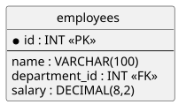
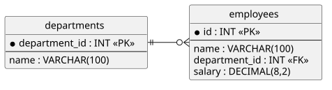
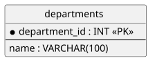

<!-- _class: lead -->

# SQL
## DBI 3xHIF — Course Introduction

---

## Agenda

1. Welcome
2. Grading
3. Course Contents
4. Tooling Setup: Docker & MySQL Workbench
5. Recap: SELECT & Clauses
6. Recap: INNER vs. OUTER JOIN
7. Recap: DDL & DML Basics

---

## Learning Goals

- I know the grading criteria for this course
- I know which topics this course covers, from basic queries to database administration
- I have a MySQL database running in Docker and can connect to it with MySQL Workbench
- I can recall `SELECT` with its clauses, `JOIN`s, and the basic `DDL`/`DML` statements from 2xHIF

---

## Welcome to SQL in 3rd grade HIF

Our (database / SQL) goals:

- Build on the SQL you already know from 2xHIF
- Go beyond basic querying: subqueries, set operations, normalization, views, administration
- Work hands-on against a real MySQL database, running in Docker

---

## Grading

<div class="highlight-box">
<p>Data Modeling: 67%</p>
<p>SQL: 33%</p>
</div>

---

## Grading - Data Modeling

- Exams: 50%
- Class Participation (Mitarbeit): 50%
   - Revisions
   - Active Participation
   - Exercise Completion

<div class="highlight-box">
<p>You <strong>must</strong> hand in <strong>at least 50%</strong> of the exercises for a positive grade.</p>
</div>

---

## Course Contents (1/2)

- **DDL & DML**: creating and changing schema and data
- **DQL**: from basic `SELECT`s to subqueries, correlated subqueries, and set operations (`UNION`)
- **Reverse Engineering**: recovering a model from an existing database

---

## Course Contents (2/2)

- **Normalization**: theory and a practical how-to
- **Views**: saving queries as virtual tables
- **Database Administration**: users, privileges, backup
- **Indexing**: speeding up queries

---

## Tooling Setup

Required tools for this course:

- Docker
- MySQL (as a Docker image)
- MySQL Workbench

---

## Docker Setup

Run a MySQL server locally as a container:

```bash
docker run --name dbi-mysql \
  -e MYSQL_ROOT_PASSWORD=changeme \
  -p 3306:3306 \
  -d mysql:8.0
```

- `-p 3306:3306` exposes the default MySQL port on your machine
- The container keeps running in the background (`-d`) until you stop it

---

## MySQL Workbench Setup

Create a new connection in MySQL Workbench:

- Hostname: `127.0.0.1`
- Port: `3306`
- Username: `root`
- Password: whatever you set as `MYSQL_ROOT_PASSWORD`

---

# Recap: 2xHIF

---

## Recap: SELECT & Clauses — Problem

HR needs a shortlist for the next raise round: the names and salaries of everyone in
department 3 earning less than 4500, cheapest first.



---

## Recap: SELECT & Clauses — Solution

```sql
SELECT name, salary
FROM employees
WHERE department_id = 3 AND salary < 4500
ORDER BY salary ASC;
```

---

## Recap: SELECT & Clauses — Explanation

- `WHERE` filters rows; combine conditions with `AND`/`OR`/`NOT`, or use `BETWEEN`, `IN`, `LIKE`
- `ORDER BY` sorts the result, `ASC` by default — sort by multiple columns left to right
- `DISTINCT` removes duplicate rows from the result
- `NULL` means "unknown" — never equal to anything, always use `IS NULL`/`IS NOT NULL`

---

## Recap: INNER JOIN — Problem

List every employee's name together with the name of their department.



---

## Recap: INNER JOIN — Solution

```sql
SELECT e.name, d.name AS department
FROM employees e
INNER JOIN departments d ON e.department_id = d.department_id;
```

---

## Recap: INNER JOIN — Explanation

- `INNER JOIN` returns only the rows that match in **both** tables — an intersection
- `ON` defines the join condition; table aliases (`e`, `d`) keep column references short
- An employee with no `department_id` would be silently dropped from the result

---

## Recap: OUTER JOIN — Problem

Marketing just hired someone who hasn't been assigned to a department yet. List every
employee and their department name — even employees without one.


Same tables as before — `department_id` on `employees` is optional (nullable).

---

## Recap: OUTER JOIN — Solution

```sql
SELECT e.name, d.name AS department
FROM employees e
LEFT JOIN departments d ON e.department_id = d.department_id;
```

---

## Recap: OUTER JOIN — Explanation

- `LEFT JOIN` keeps every row from the left table (`employees`), filling in `NULL` where
  there's no match — `INNER JOIN` would have silently dropped the unassigned employee
- `RIGHT JOIN` is the mirror image: keeps every row from the right table instead
- Rule of thumb: `INNER JOIN` when you only want matches, `OUTER JOIN` when you want to
  keep unmatched rows too

---

## Recap: DDL & DML Basics — Problem

The company just started an internship program. There's no table for interns yet, and
no data for the first three interns. Shortly after, one intern's stipend changes, and
another leaves the company.



The new `interns` table doesn't exist yet — but each intern belongs to one of these
existing departments.

---

## Recap: DDL & DML Basics — Solution

```sql
CREATE TABLE interns (
    id INT PRIMARY KEY AUTO_INCREMENT,
    name VARCHAR(100) NOT NULL,
    department_id INT,
    stipend DECIMAL(8,2)
);

INSERT INTO interns (name, department_id, stipend) VALUES
    ('Mia Klein', 3, 900.00),
    ('Jonas Bauer', 1, 900.00),
    ('Lea Fischer', 3, 950.00);

UPDATE interns SET stipend = 1000.00 WHERE name = 'Mia Klein';
DELETE FROM interns WHERE name = 'Jonas Bauer';
```

---

## Recap: DDL & DML Basics — Explanation

- `CREATE TABLE table (column datatype constraint, ...)` — defines a new table's structure (DDL)
- `INSERT INTO table (columns) VALUES (...)` — adds new rows, one statement can add many (DML)
- `UPDATE table SET column = value WHERE ...` — changes matching rows (DML)
- `DELETE FROM table WHERE ...` — removes matching rows (DML)
- Without `WHERE`, both `UPDATE` and `DELETE` act on **every** row

---

<!-- _class: invert -->

## Summary

- We recapped `SELECT` with its clauses, `JOIN`s, and the basic `DDL`/`DML` statements
- This is the foundation the rest of the course builds on
- Next up: DDL in depth
