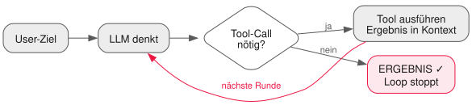

<!-- _class: lead -->

# 07 - Eigenbau-Agent: Der Loop
## PAE - SJ 2026/27

---

## Wiederholung in 60 Sekunden

- Qualitätssicherung steht: Tests, Hooks, Reviews — nichts geht mehr ohne
- Ihr habt Agents benutzt, verglichen und gezähmt (L03–L06)
- Heute drehen wir den Spieß um: **Ihr baut selbst einen**

---

## Der Moment: euer Jahresprojekt beginnt

- Ab heute besitzt jedes Team echte Agenten-Technologie — selbst gebaut
- **Harness** = das Gerüst um das Modell:
  Tools, die Schleife, Regeln, Logging
- Claude Code & Co. sind genau so aufgebaut — nur mit mehr Polster
- Version für Version bauen wir ihn dieses Jahr aus: **v0.1 → v0.6 → Abschlussprojekt**

---

## Anatomie: Modell + Tools + Schleife



- Kein Zauber, keine Intelligenz im Harness selbst: **nur eine while-Schleife**
- Wer das versteht, versteht jeden Agenten am Markt

---

## Function Calling: die Anfrage

Das Modell bekommt Werkzeuge angeboten — als JSON Schema (Lektion 02!):

```json
{
  "model": "llama-3.3-70b-versatile",
  "messages": [{ "role": "user", "content": "Wie viele Zeilen hat loop.ts?" }],
  "tools": [{
    "type": "function",
    "function": {
      "name": "read_file",
      "description": "Liest eine Datei im Arbeitsverzeichnis",
      "parameters": { "type": "object",
        "properties": { "path": { "type": "string" } },
        "required": ["path"] }
    }
  }]
}
```

---

## Function Calling: die Antwort

```json
{
  "choices": [{
    "finish_reason": "tool_calls",
    "message": {
      "role": "assistant",
      "tool_calls": [{
        "id": "call_1",
        "type": "function",
        "function": { "name": "read_file",
                      "arguments": "{\"path\":\"loop.ts\"}" }
      }]
    }
  }]
}
```

Achtung: `arguments` ist ein **JSON-String** — ihr parst selbst.
Und: Das Modell *führt nichts aus*. Es wünscht sich nur.

---

## Ergebnis zurückspielen

```json
{ "role": "tool", "tool_call_id": "call_1",
  "content": "// 42 Zeilen TypeScript ..." }
```

- Tool-Ergebnis wandert als Nachricht in den Kontext
- Nächste Loop-Runde: Das Modell sieht sein Ergebnis und entscheidet weiter
- Genau diese drei Bausteine — anbieten, empfangen, zurückspielen — sind der ganze Trick

---

## Stop-Bedingungen: wann hört der Loop auf?

- Modell sendet keinen `tool_calls`-Wunsch mehr → **es ist fertig**
- Sicherheitsnetz immer dazu bauen:
  - **Maximale Iterationen** (z.B. 25 Schritte)
  - **Budget-Limit** (Tokens — Vorschau auf Lektion 12)
  - **Fehler nach N Versuchen** statt Endlos-Retry
- Ein Agent ohne Stop-Bedingungen ist ein Geldverbrennungsroboter

---

## Tool-Design: Grundregeln

- Kleine, klar benannte Tools — `read_file`, nicht `do_everything`
- Die Beschreibung ist **UX fürs Modell**: wann benutzen, wann nicht
- Fehlermeldungen helfen weiter statt abzubrechen:

```plaintext
Schlecht:  Error
Gut:       Datei 'lopp.ts' nicht gefunden.
           Vorhanden: loop.ts, tools.ts. Tipp: erst list_files verwenden.
```

Klingt wie gute Mensch-UX? Ist es auch. Modelle sind Leser wie wir.

---

## Sicherheit ab Sekunde eins

<div class="highlight-box danger">
<ul>
<li><code>run_command</code> ist ein Superheld mit Zero-Tolerance-Politik</li>
<li>Allowlist/Prefix-Check: welche Befehle dürfen überhaupt durch?</li>
<li>Arbeitsverzeichnis begrenzen — kein Ausbruch nach <code>../..</code></li>
<li>Kursregel aus L03 gilt erst recht: Vollauto nur im eigenen Sandbox-Ordner</li>
<li>In Lektion 10 bauen wir daraus ein echtes Permission-System</li>
</ul>
</div>

---

## Transkripte: von Anfang an mitschreiben

- Jede Loop-Runde in eine Datei: `transcript.jsonl` (wie `usage.log` in L01)
- Eine Zeile = ein Ereignis: Prompt, Tool-Call, Tool-Ergebnis, Antwort
- Warum das entscheidend ist:
  - Debugging: Wo hängt der Agent?
  - Kosten: Wie viele Tokens pro Aufgabe?
  - Audit: Was hat er getan? (wird Pflicht in L10)

---

## Der Loop in 12 Zeilen Pseudocode

```typescript
while (true) {
  const res = await chat(messages);          // .env-Zugang wie in L01
  if (!res.toolCalls?.length) break;         // fertig!
  for (const call of res.toolCalls) {
    log(call);                               // transcript.jsonl
    const out = await execute(call);         // Registry-Lookup
    messages.push(toolResult(call.id, out));
  }
  if (++step > MAX_STEPS) break;             // Sicherheitsnetz
}
```

Alles andere — Registry, Tools, Logging — ist Handwerkszeug drumherum.
~150 Zeilen TypeScript reichen für einen funktionierenden Agenten.

---

## Übung Teil 1: harness v0.1 bauen

<div class="highlight-box">
<ol>
<li>Ordner <code>harness/</code> im Team-Repo anlegen — Zugangsdaten via bestehendes <code>.env</code>-Muster</li>
<li>Tool-Registry mit zwei Tools implementieren: <code>read_file</code>, <code>run_command</code></li>
<li>Die Schleife: Tools anbieten, <code>tool_calls</code> verarbeiten, Ergebnisse zurückspielen</li>
<li>Jede Runde nach <code>transcript.jsonl</code> schreiben</li>
<li><code>MAX_STEPS</code>-Sicherheitsnetz einbauen</li>
</ol>
</div>

---

## Übung Teil 2: Dem Agenten Arbeit geben

<div class="highlight-box">
<ol>
<li>Aufgabe A: "Liste alle Dateien hier und zähle deren Zeilen" — beobachtet die Schleife</li>
<li>Aufgabe B (absichtlich böse): Datei anfordern, die nicht existiert — wie reagiert er?</li>
<li>Aufgabe C: <code>run_command</code>-Missbrauch versuchen (<code>rm</code>-Variante) — was fängt euer Check ab?</li>
<li>Verbessert die Fehlermeldungen eurer Tools, bis B sauber durchläuft</li>
</ol>
</div>

Aufgabe C ist kein Scherz: Genau dafür gibt es später Permissions (L10).

---

## Meilenstein: Tag v0.1

```bash
git tag -a v0.1 -m "Loop + read_file + run_command + Transcript"
git push origin v0.1
```

v0.1 zählt als erreicht, wenn:

- [ ] Eine natürlichsprachliche Aufgabe wird komplett selbstständig gelöst
- [ ] `transcript.jsonl` zeigt jede Entscheidung nachvollziehbar
- [ ] Das Sicherheitsnetz stoppt Dauerschleifen

---

## Deliverable & Offenes Lab

**Deliverable heute:** `harness/` v0.1 — getaggt, gepusht, dokumentiert im Journal.

**Offenes Lab:** Gebt eurem Agenten eine Eigenheit:
ein Schul-Domain-Tool (`stundenplan_heute`?), bessere System-Prompts,
Streaming-Ausgabe — Hauptsache, euer Harness ist nicht austauschbar.

---

## Ausblick: Nächste Einheit

- Eure Tools sind fest verdrahtet — jeder will dieselben Werkzeuge neu schreiben
- Lösung: ein Standard-Steckplatz für Tools — **MCP**
- Wir bauen einen eigenen MCP-Server und stöpseln ihn in *zwei* Hosts gleichzeitig

---

## Was wir heute gelernt haben

- Agent = Modell + Tools + Schleife — jetzt habt ihr die Schleife selbst geschrieben
- Function Calling: Tools anbieten, Wünsche empfangen (`arguments` = JSON-String!), Ergebnisse zurückspielen
- Stop-Bedingungen sind Pflichtausstattung
- Tool-Beschreibungen und Fehlermeldungen sind UX fürs Modell
- Transkripte ab Tag eins: Debugging, Kosten, Audit — v0.1 ist im Trockenen
