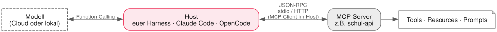

<!-- _class: lead -->

# 08 - MCP & Tool-Design
## PAE - SJ 2026/27

---

## Wiederholung in 60 Sekunden

- Euer Harness lebt: Loop, zwei Tools, Transkript — getaggt als v0.1
- Die Tools sind fest im Code verdrahtet
- Heute lernen sie Fliegen: **MCP** macht Werkzeuge austauschbar und teilbar

---

## Das Problem mit eingebauten Tools

- Jeder schreibt `read_file`, `run_command` & Co. selbst neu — tausendfach
- Ein Tool, das nur *euer* Agent versteht, nützt der Klasse nichts
- Und umgekehrt: Es gibt schon Server für alles mögliche — wie anschließen?

```plaintext
Vor MCP: jedes Gerät hat einen Specker   →  Mit MCP: USB-Standard
```

---

## MCP in einem Satz

**Model Context Protocol** — ein offener Standard (2024 von Anthropic gestartet,
heute breit adoptiert), der beschreibt, wie Agenten auf Tools und Daten zugreifen.

| Rolle | Wer ist das? |
| --- | --- |
| Host | Die Agenten-App: Claude Code, OpenCode — oder euer Harness |
| Client | Die Verbindung vom Host zu genau einem Server |
| Server | Bietet Tools / Resources / Prompts an (z.B. euer Schul-API-Server) |

Euer Harness wird ab heute auch ein MCP-*Host* sein.

---

## Die Architektur im Bild



- Der Client lebt **im Host** — ein Client pro Server-Verbindung
- Für das Modell sieht ein MCP-Tool aus wie jedes andere Function-Calling-Tool

---

## Was ein Server anbieten kann

| Angebot | Bedeutung | Beispiel |
| --- | --- | --- |
| **Tools** | Aktionen ausführen | Mensa-Menü abrufen, Raum buchen |
| **Resources** | Daten lesen (read-only) | Stundenplan als Dokument |
| **Prompts** | Fertige Prompt-Vorlagen | "Fasse meinen Tag zusammen" |

Wir konzentrieren uns heute auf **Tools** — die anderen beiden kennt ihr bald.

---

## Wie es technisch läuft

- Protokollbasis: JSON-RPC — bekannte Macht, einfaches Format
- Transporte: `stdio` (lokaler Prozess) oder HTTP
- Der Server beschreibt jedes Tool: Name + Beschreibung + Input-Schema
- Der Host reicht diese Beschreibungen ans Modell weiter —
  ab da ist es normales Function Calling wie in Lektion 07

Ihr werdet erkennen: MCP ist keine Magie, sondern ein sauberer Stecker.

---

## Ein Tool von innen (TypeScript SDK)

```typescript
import { McpServer } from "@modelcontextprotocol/sdk/server/mcp.js";
import { z } from "zod";

const server = new McpServer({ name: "schul-api", version: "0.1" });

server.registerTool("mensa_menu", {
  description: "Tagesmenü der Mensa. Ohne Datum = heute.",
  inputSchema: { datum: z.string().optional() }
}, async ({ datum }) => ({
  content: [{ type: "text", text: menuFuer(datum ?? heute()) }]
}));
```

- Schema validiert die Eingabe **bevor** euer Code läuft
- Die Beschreibung entscheidet, ob das Modell das Tool überhaupt wählt

---

## Tool-Beschreibungen sind UX

Schwach:

> `description: "Menü"`

Stark:

> "Tagesmenü der Mensa Spengergasse. Nutzen, wenn nach Essen,
> Mittagpause oder Speiseplan gefragt wird. Nicht für Öffnungszeiten."

<div class="highlight-box">
<p>Regel: Beschreibe <strong>wann</strong> man das Tool nutzt — und wann <strong>nicht</strong>. Das spart dem Modell Fehlgriffe und euch Tokens.</p>
</div>

---

## Fehlermeldungen sind UX (Fortsetzung)

Aus Lektion 07 bekannt — bei MCP gilt es doppelt:

```plaintext
Schlecht:  { "error": "invalid date" }

Gut:       { "error": "Datum '32.13' ist kein gültiges Format.
             Erwartet: YYYY-MM-DD, z.B. '2026-10-05'." }
```

Ein Modell, das weiß *wie weiter*, macht weiter.
Ein Modell, das nur "Error" sieht, improvisiert — meistens falsch.

---

## Security Surface: ernst nehmen

<div class="highlight-box danger">
<ul>
<li>Jeder MCP-Server ist Code-Ausführung hinter einer Modell-Türöffnung</li>
<li>Nur Server aus trusted Quellen installieren — nicht "irgendein npm-Paket"</li>
<li>Least Privilege: read-only zuerst, Schreibaktionen nur wenn nötig</li>
<li>Keine Secrets als Tool-Argumente durch den Kontext schleusen</li>
<li>Vertiefung mit Angriffsszenarien: Lektion 10 (Attack-&amp;-Defend-Day)</li>
</ul>
</div>

---

## Übung Teil 1: Der eigene MCP-Server

<div class="highlight-box">
<ol>
<li>Schul-Domain wählen: Stundenplan, Mensa oder Raumfinder — Mock-Daten genügen völlig</li>
<li>Zwei Tools mit <code>registerTool</code>, Zod-Schemas, hilfreichen Fehlermeldungen</li>
<li>Transport: <code>stdio</code></li>
<li>Testen mit dem Inspector: <code>npx @modelcontextprotocol/inspector</code></li>
<li>Erst weitermachen, wenn beide Tools dort sauber laufen</li>
</ol>
</div>

---

## Übung Teil 2: Ein Server, zwei Hosts

<div class="highlight-box">
<ol>
<li><strong>Euer Harness</strong>: SDK-Client einbauen — beim Start Tools listen, in die eigene Registry mergen (<code>mcp_</code>-Präfix), Calls über die Schleife</li>
<li><strong>Ein fertiger Host</strong>: denselben Server in OpenCode oder Claude Code registrieren</li>
<li>Dieselbe Frage an beide stellen: Nutzt er euer Tool?</li>
<li>Tag <code>v0.2</code> setzen, wenn beide Hosts funktionieren</li>
</ol>
</div>

Genau das ist der Beweis: einmal bauen, überall steckbar.

---

## Deliverable & Offenes Lab

**Deliverable heute ins Team-Repo:**

- `mcp-server/` — euer Schul-API-Server mit zwei Tools
- `harness/` v0.2 — MCP-Client integriert, getaggt

**Offenes Lab:** Dritt-Tools ausprobieren — einen öffentlichen MCP-Server
(e.g. Filesystem, Fetch) anbinden und im Journal dokumentieren:
Was bietet er? Wie gut sind seine Beschreibungen?

---

## Ausblick: Nächste Einheit

- Tools handeln — aber woher kommt das **Wissen**, das Agenten brauchen?
- **RAG**: Embeddings, Chunking, Vektorstore
- Wir geben dem Harness ein Gedächtnis für Schuldokumente

Bringt eine PDF/ein Dokument eurer Wahl mit — es wird verschluckt.

---

## Was wir heute gelernt haben

- MCP standardisiert Tools/Daten zwischen Hosts und Servern (JSON-RPC, stdio/HTTP)
- Tools vs. Resources vs. Prompts — und wie Hosts sie ans Modell reichen
- `registerTool` + Zod-Schema + gute Beschreibung = gutes Tool
- Fehlermeldungen sind UX für Modelle: sagen, wie es weitergeht
- Ein Server, zwei Hosts — der Standard ersetzt hundert Integrationen (v0.2)
