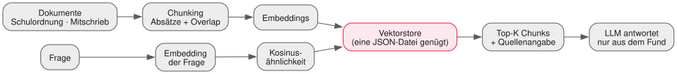

<!-- _class: lead -->

# 09 - RAG
## PAE - SJ 2026/27

---

## Wiederholung in 60 Sekunden

- MCP steckt: euer Harness nutzt fremde Tools, eigene Server, überall gleich (v0.2)
- Heute geht es nicht um Aktionen — sondern um **Wissen**
- Bringt euer mitgebrachtes Dokument: Es wird gleich verschluckt.

---

## Das Wissensproblem

- Das Modell kennt eure Schulordnung nicht — es wurde nicht darauf trainiert
- Alles ins Kontextfenster stopfen? Teuer (L01), unübersichtlich, bricht bei Größe
- Dokumente ändern sich schneller, als Modelle nachtrainiert werden
- Lösung: **Wissen erst beim Aufruf in den Kontext holen** — genau das ist RAG

**R**etrieval-**A**ugmented **G**eneration: erst suchen, dann generieren.

---

## Die Pipeline



Oben: einmalig Ingestion. Unten: bei jeder Frage. Der Store verbindet beide.

---

## Embeddings: Bedeutung als Vektor

- Ein Embedding ist eine Liste von Zahlen (~1.000 Dimensionen)
- Ähnliche Bedeutungen → ähnliche Richtungen im Raum:

```plaintext
"Mensa-Menü"      ──►  [0.82, -0.13, 0.44, ...]
"Speiseplan"      ──►  [0.79, -0.11, 0.47, ...]   ← nah dran!
"Klassenvorstand" ──►  [-0.31, 0.65, -0.08, ...]  ← weit weg
```

- Die Suche später ist reine Geometrie: **wer steht wem nahe?**

---

## Embeddings beschaffen

OpenAI-kompatibel wie gehabt: `POST {BASE_URL}/embeddings` mit `input`-Array.

| Weg | Modell | Anmerkung |
| --- | --- | --- |
| Ollama lokal | `nomic-embed-text` o.ä. | gratis, offline, Daten bleiben bei euch |
| Mistral | `mistral-embed` | im Experiment-Free-Tier enthalten |
| Gemini | Embedding-Modelle | Free-Tier, Limits beachten |

<div class="highlight-box warning">
<p>Nicht jeder Chat-Anbieter bietet Embeddings an (Groq z.B. nicht). Dann mischen — oder lokal. Euer <code>.env</code>-Muster macht das trivial.</p>
</div>

---

## Chunking: die unterschätzte Stufe

- Ganze Datei als ein Chunk? Zu grob — die Suche trifft immer halb daneben
- Zu kleine Chunks? Der Zusammenhang zerreißt
- Praxis: nach **Überschriften/Absätzen** teilen, fixe Größe mit **Overlap** als Fallback
- Metadaten mitspeichern: Quelle, Abschnitt, Seite — ohne die ist keine Zitierfähigkeit

Merksatz: **So groß wie nötig, so klein wie möglich.**

---

## Die Suche: Kosinusähnlichkeit

- Vergleich per Winkel zwischen Frage-Vektor und Chunk-Vektoren
- Bei < 10.000 Chunks reicht **brute force**: alle vergleichen, Top-K nehmen
- Eine JSON-Datei + 30 Zeilen TypeScript = eurer Vektorstore
- Echte Systeme (pgvector, Qdrant, Chroma) können alles — brauchen tut ihr es hier nicht

---

## Grounding gegen Halluzinationen

- Regel fürs Tool-Ergebnis: **Antworte ausschließlich aus den gefundenen Chunks**
- "In den Unterlagen nicht gefunden" ist eine vollwertige, gute Antwort
- Jede Antwort nennt ihre Quelle: `[Schulordnung, Abschnitt 3.2]`
- Damit wird aus dem Sprachmodell eine belegbare Auskunftsstelle

---

## Wann RAG, wann langer Kontext?

| Situation | Besser |
| --- | --- |
| Wenige kurze Docs, selten ändernd | Direkt ins Kontextfenster |
| Viele/lange Docs, sich ändernd | RAG |
| Antwort muss Quelle zitieren | RAG |
| Aufgabe braucht *alles* gleichzeitig (Refactoring) | Kontextfenster |

RAG spart Tokens **pro Frage**, kostet aber Build- und Pflegeaufwand. Abwägen wie Ingenieur:innen.

---

## Eval: Golden Questions

- Ohne Messung ist RAG Vibecoding mit Extra-Schritten (Kursmantra!)
- **Golden Set**: 8–10 Fragen + die erwartete Quelle, vorab notiert
- Metrik: Liegt die richtige Quelle in den **Top-K** Treffern? (`Recall@3`)
- Chunking geändert? Embedding-Modell gewechselt? → Eval neu laufen lassen

---

## Übung Teil 1: Der Corpus

<div class="highlight-box">
<ol>
<li>Corpus sammeln: Schulordnung/Mitbring-Dokument + eure Mitschriebe (Markdown bevorzugt)</li>
<li>Chunking implementieren: nach Überschriften, Fallback fixe Größe mit Overlap</li>
<li>Embeddings erzeugen (Ollama lokal oder Mistral) — <code>.env</code>-Muster nutzen</li>
<li>Vektorstore als <code>vectors.json</code>: Chunk-Text + Vektor + Metadaten</li>
</ol>
</div>

---

## Übung Teil 2: Das Wissen-Tool

<div class="highlight-box">
<ol>
<li>MCP-Tool oder eingebautes Tool <code>knowledge_search(query)</code>: Top-3-Chunks mit Quellenangabe zurückgeben</li>
<li>In den Harness integrieren — das Modell entscheidet jetzt selbst, wann es sucht</li>
<li>Golden Set schreiben (≥ 8 Fragen) und <code>Recall@3</code> messen</li>
<li>Ergebnis + schlechteste Frage dokumentieren: <code>docs/rag-eval.md</code></li>
</ol>
</div>

---

## Deliverable & Offenes Lab

**Deliverable heute ins Team-Repo:** Harness v0.3 mit Wissenstool,
`vectors.json`, Golden Set + `docs/rag-eval.md`. Tag setzen!

**Offenes Lab:** Experimente am Pipeline-Anfang:
Overlap vs. Überschriften-Chunks, andere K-Werte —
jeweils mit gemessenem Recall. Meinung zählt nicht, der Messwert schon.

---

## Ausblick: Nächste Einheit

- Euer Agent kann denken, handeln und wissen — aber was kann er alles **anrichten**?
- Nächste Einheit: **Attack-&-Defend-Day**
  Prompt Injection, Permissions, Audit-Log
- Ihr bekommt die Harness-Repos eines anderen Teams — zum Angreifen. Legal.

---

## Was wir heute gelernt haben

- RAG = erst suchen, dann generieren; Pipeline: Chunking → Embeddings → Suche → Top-K
- Embeddings machen Bedeutung berechenbar (Kosinusähnlichkeit)
- Chunking-Qualität bestimmt Retrieval-Qualität; Metadaten ermöglichen Zitate
- Brute-Force-Suche über JSON reicht — Vektor-DBs sind Optimierung, kein Muss
- Golden Questions + Recall@3 machen RAG messbar — v0.3 hat ein Gedächtnis
