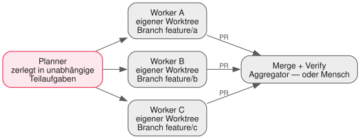

<!-- _class: lead -->

# 11 - Multi-Agent & A2A
## PAE - SJ 2026/27

---

## Wiederholung in 60 Sekunden

- v0.4 ist erwachsen: Permissions, Audit-Log, Defense in Depth
- Ein Agent, eine Schleife — sauber. Aber manche Aufgaben sind zu groß für einen Faden.
- Heute: Planner/Worker, Subagents, Git Worktrees — und Agenten, die miteinander reden.

---

## Warum mehrere Agenten?

| Gewinn | Erklärung |
| --- | --- |
| Kontext-Isolation | Recherche verschmutzt den Hauptfaden nicht (L04-Rückruf) |
| Parallelität | Unabhängige Teilaufgaben laufen gleichzeitig |
| Spezialisierung | Kleines Modell fürs Grobe, großes Modell fürs Schwere |

Und der Preis: mehr Koordination, mehr Kosten, mehr Fehlerflächen.
Merksatz: **Erst ein Agent sauber — dann der Schwarm.**

---

## Muster 1: Planner / Worker



- Der Planner zerlegt; die Worker führen isoliert aus; Merge + Verify am Ende
- Die Qualität steht und fällt mit der Zerlegung — nicht mit der Worker-Anzahl

---

## Muster 2: Subagent (Delegation)

- Hauptagent spawnt einen Spezialisten mit **frischem, kleinem Kontext**
- Der Subagent arbeitet, fasst zusammen, übergibt nur das Ergebnis
- Bekommt typischerweise nur, was er braucht: den Diff, das Dokument, die Frage
- Kennt ihr aus Lektion 04 — jetzt bauen wir es uns selbst

```plaintext
Hauptagent: "Reviewer: prüfe nur diesen Diff auf Fehlerbehandlung."
Subagent:   sieht Diff → analysiert → gibt JSON-Liste zurück → verschwindet
```

---

## Das harte Problem: Paralleles Arbeiten

- Zwei Worker, dieselben Dateien → Merge-Konflikt garantiert
- Konflikte sind bei Menschen ein **soziales** Problem, bei Agenten ein technisches
- Beide lösen sich gleich: klare Zuständigkeiten + sauberes Git
- Deshalb heute viel Git — denn Git *ist* das Orchestrierungs-Werkzeug

---

## Git Worktrees: mehrere Checkouts, ein Repo

```bash
git worktree add ../harness-worker-a feature/a
git worktree add ../harness-worker-b feature/b
```

```plaintext
harness/            ← Haupt-Checkout (bleibt sauber)
harness-worker-a/   ← eigener Ordner, eigener Branch
harness-worker-b/   ← parallel, ohne sich zu berühren
```

- Jeder Worker bekommt eigenen Ordner + Branch — null Datei-Kollisionen
- Am Ende: Merge zurück, `git worktree remove` aufräumen

---

## Zerlegung ist die eigentliche Kunst

- Gute Teilaufgaben: unabhängig, an Modulgrenzen geschnitten ("Datei X", "Modul Y")
- Abhängigkeiten explizit machen: "erst Datenmodell, dann Endpoint" (L05-Rückruf)
- Schlecht zerlegt = Merge-Hölle — egal wie viele Worker laufen
- Faustregel: Wenn zwei Teilaufgaben dieselbe Datei ändern müssen,
  gehören sie zu **einer** Aufgabe

---

## A2A: wenn Agenten reden

**A2A (Agent-to-Agent)** — offener Standard (2025 von Google initiiert, breit getragen)
für Kommunikation zwischen fremden Agenten:

- **Agent Card**: "Wer bist du? Was kannst du? Wie ruft man dich?" (maschinenlesbar)
- **Tasks**: Auftrag geben, Status abfragen, Ergebnis abholen
- Damit kann Agent A ohne Insiderwissen mit Agent B von sonstwem arbeiten

---

## MCP vs. A2A

| | MCP | A2A |
| --- | --- | --- |
| Verbindet | Agent ↔ Tools/Daten | Agent ↔ Agent |
| Analogie | USB-Port für Werkzeuge | Visitenkarte + Auftrag für Kollegen |
| Baustein | Tools, Resources, Prompts | Agent Card, Tasks |
| Bei euch | v0.2 seit Lektion 08 | heute: Konzept + Ausblick |

Die beiden konkurrieren nicht — sie lösen verschiedene Probleme.

---

## Realitätscheck

<div class="highlight-box warning">
<ul>
<li>Mehr Agenten = mehr Tokens, mehr Koordination, mehr Fehlerflächen</li>
<li>"Microservices fürs Denken" ist auch ein Hype — nicht jede Aufgabe braucht einen Schwarm</li>
<li>Ein durchdachter Single-Agent schlägt oft drei schlecht koordinierte Worker</li>
<li>Orchestrierung lohnt erst bei echter Unabhängigkeit der Teilaufgaben</li>
</ul>
</div>

---

## Übung Teil 1: PLAN & SPLIT

<div class="highlight-box">
<ol>
<li>Refactoring-Aufgabe im <code>chaos-shop</code>-Repo (bekommt ihr gestellt)</li>
<li>Planner-Phase <strong>ohne Code</strong>: Aufgabe in 2–3 unabhängige Teilaufgaben zerlegen, je mit klarer Datei-Grenze</li>
<li>Zerlegung schriftlich fixieren (<code>docs/orchestration-plan.md</code>)</li>
<li>Pro Teilaufgabe: Worktree + Branch anlegen</li>
</ol>
</div>

Wer hier schludert, merge ich später persönlich — mit Freude.

---

## Übung Teil 2: RUN & MERGE

<div class="highlight-box">
<ol>
<li>Worker parallel starten: zwei Terminals, zwei Branches, gleiche Startzeit stoppen</li>
<li>Messwert notieren: parallel vs. geschätzt seriell — war es wirklich schneller?</li>
<li>Mergen, Tests grün?, Konflikt-Retro: Wo kollidierte es und warum?</li>
<li>Stretch: Tool <code>spawn_subagent</code> in euren Harness bauen → Tag <code>v0.5</code></li>
</ol>
</div>

---

## Deliverable & Offenes Lab

**Deliverable heute:** Merge-Ergebnis + `docs/orchestration-plan.md` +
Konflikt-Retro im Journal. Stretch: v0.5 mit `spawn_subagent`.

**Offenes Lab:** Eure eigene Zerlegung verbessern:
Welche Teilaufgabe war eigentlich abhängig? Neu schneiden, neu denken —
die Plan-Qualität ist eure neue Meta-Skill.

---

## Ausblick: Nächste Einheit

- Euer Harness ist mächtig geworden — und verbraucht entsprechend
- **Caching, Budgets & Optimierung**: Cost-Dashboard, Compaction, Modell-Routing
- Challenge der nächsten Einheit: gleiche Qualität, weniger Tokens

Bringt eure `transcript.jsonl` mit — darin steckt euer Verbrauch.

---

## Was wir heute gelernt haben

- Planner/Worker und Subagent-Delegation als Orchestrierungs-Muster
- Git Worktrees machen parallele Agent-Arbeit kollisionsfrei bis zum Merge
- Zerlegungsqualität > Worker-Anzahl; Datei-Grenzen sind euer Freund
- A2A standardisiert Agent-zu-Agent-Kommunikation (Agent Cards, Tasks) — komplementär zu MCP
- Erst single-agent sauber, dann Swarm — Orchestrierung kostet selbst Tokens (v0.5 optional)
