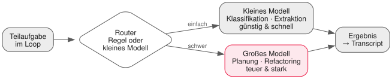

<!-- _class: lead -->

# 12 - Caching, Budgets & Optimierung
## PAE - SJ 2026/27

---

## Wiederholung in 60 Sekunden

- v0.5 orchestriert Worker — und eure `transcript.jsonl` kennt jeden Token
- Heute wird gewirtschaftet: gleiche Qualität, weniger Verbrauch
- Das ist der Unterschied zwischen "läuft" und "betreibbar"

---

## Auswertung: Was kostet eine Aufgabe?

Eure Transkripte sind das Rohmaterial — jetzt fragen wir sie aus:

- Tokens pro Aufgabe gesamt (Input/Output/Cache-Hits)
- Die teuerste einzelne Loop-Runde — und warum sie teuer war
- Output-Anteil: Habt ihr präzise Antworten gefordert oder Romane?

<div class="highlight-box">
<p>Wer nicht misst, optimiert Gerüchte. Erst Zahlen, dann Maßnahmen.</p>
</div>

---

## Wo der Verbrauch verbrennt

| Kostenfalle | Symptom im Transcript |
| --- | --- |
| Riesiger System-Prompt, jede Runde neu | Hoher Input pro Schritt |
| Wachsende Konversationshistorie | Input wächst quadratisch über die Zeit |
| Volle Dateien als Tool-Ergebnis | Ein `read_file` frisst tausende Tokens |
| Falsches Modell für die Aufgabe | Reasoning-Modell klassifiziert drei Zeilen |

---

## Prompt Caching: die Mechanik

- Provider cachen **identische Prefixes** des Prompts
- Gecachte Input-Tokens: deutlich billiger *und* schneller
- Bedingung: Der **Anfang** muss byte-identisch bleiben

Konsequenzen für euren Harness:

1. Stabile Reihenfolge: System-Prompt zuerst — nie dynamische Daten davor
2. Sich ändernde Inhalte (Datum, Uhrzeit) gehören ans **Ende**
3. `usage` zeigt Cache-Treffer (`cached_tokens`, feldabhängig vom Provider) — loggen!

---

## Compaction: wenn die Historie wächst

Lange Loops blähen den Kontext auf. Gegenmittel:

- Alte Runden **zusammenfassen** lassen ("Was wurde bisher erreicht?")
- Tool-Ergebnisse kürzen: relevante Zeilen statt ganzer Dateien
- Fenster-Slicing: nur die letzten N Runden voll, davor Zusammenfassung

Trade-off bewusst wählen: Jede Kompression kann Information verlieren —
bei kritischen Details lieber mehr Kontext behalten.

---

## Modell-Routing: nicht alles ist schwer



Faustregel: **Das kleinste Modell, das die Aufgabe löst** (L01-Rückruf).
Der Router entscheidet pro Teilaufgabe — Regel oder kleines Klassifikationsmodell.

---

## Budget-Guardrails

```json
{ "maxTokensPerRun": 50000, "warnAtPercent": 80 }
```

- Hartes Limit pro Run — in Tokens, nicht in Gerüchten
- Bei 80%: Warnung ins Log
- Bei 100%: **graceful stop** — sauber beenden + Zusammenfassung,
  nicht mitten im Refactoring absäbeln
- Das ist die Lektion-10-Denke auf Kosten angewendet: Grenzen maschinell erzwingen

---

## Das Dashboard (minimal reicht)

Pro Run eine Zeile — Quelle ist längst vorhanden:

```plaintext
run_id   tokens_in  tokens_out  cached  ~EUR    dauer   ergebnis
r_042    18.204     2.981       12k     0.031   94s     ok
```

- CLI oder generierte Markdown-Tabelle — Hauptsache automatisch
- Simulierte Preise aus eurer `prices.json` (L01)
- Trend lesen können: Was ist diese Woche teurer geworden?

---

## Optimierungs-Checkliste

1. Cache-fähige Prompt-Reihenfolge (System-Prompt stabil vorne)
2. Historie trimmen / Compaction bei langen Loops
3. Tool-Outputs beschneiden — Zeilenbereiche statt ganze Dateien
4. Routing: kleines Modell fürs Grobe
5. `max_tokens` pro Antwort begrenzen, präzise Antworten fordern
6. Nach jeder Maßnahme: **Eval laufen lassen** (L02/L09)

Punkt 6 ist kein Bonus. Er ist der Punkt.

---

## Übung Teil 1: Das Cost-Dashboard

<div class="highlight-box">
<ol>
<li>Skript bauen: parst <code>transcript.jsonl</code>, aggregiert pro Run (in/out/cached)</li>
<li>Simulierte Euro via <code>prices.json</code> dazu rechnen</li>
<li>Ausgabe als Tabelle (<code>cost-report.ts</code>) — Top-3-Kostenquellen identifizieren</li>
<li>Befund dokumentieren: Wo verbrennt euer Harness am meisten?</li>
</ol>
</div>

---

## Übung Teil 2: Budget & Challenge

<div class="highlight-box">
<ol>
<li>Budget-Guardrail einbauen: 80%-Warnung, graceful Stop bei Limit</li>
<li><strong>Challenge</strong>: Gegebene Workflow-Task unter Zielkosten bringen</li>
<li>Qualitätsanker: gleiche Punktzahl im Golden Set wie vorher (L09/L02)</li>
<li>Jede Maßnahme einzeln messen — Vorher/Nachher in <code>docs/cost-optimization.md</code></li>
</ol>
</div>

Optimieren ohne Qualitätsanker = Verschlechterung mit gutem Gewissen.

---

## Deliverable & Offenes Lab

**Deliverable heute:** Harness v0.6 — Dashboard, Budget-Limit, gemessene
Optimierungen mit Zahlen. Tag setzen!

**Offenes Lab:** Routing implementieren (zwei Modelle via `.env`) und
`cached_tokens` sichtbar machen. Ziel: euer Harness hat einen Verbrauchsausweis.

---

## Ausblick: Nächste Einheit

- Modul C ist komplett: Euer Agent kann denken, handeln, wissen, sich schützen,
  orchestrieren **und wirtschaften**
- Seitenwechsel: Wir bauen Software, die **für KI** gemacht ist
- **KI-ready Software & AI-Features** — euer POS-Projekt wartet darauf

---

## Was wir heute gelernt haben

- Transkripte auswerten statt raten: Tokens, teuerste Runden, Output-Anteil
- Prompt-Caching lebt von byte-identischen Prefixes — Architektur entscheidet
- Compaction tauscht Tokens gegen Informationsrisiko — bewusst wählen
- Modell-Routing + Budget-Guardrails = Wirtschaftlichkeit maschinell erzwungen
- Jede Optimierung braucht einen Qualitätsanker — sonst ist es nur Sparen — v0.6
