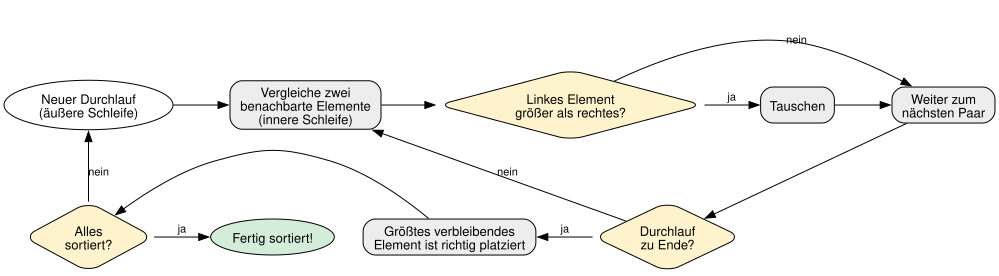
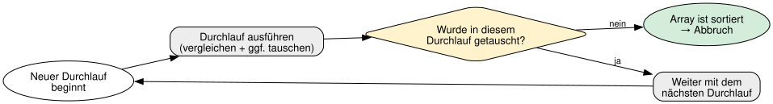

<!-- _class: lead -->

# 11 - Sortieren von Arrays
## POS - 1xHIF

---

## Agenda (1/2)

1. Wiederholung: Arrays + Schleifen
2. Warum sortieren?
3. Bubblesort - Die Idee
4. Beispiel: Schritt 1

---

## Agenda (2/3)

5. Beispiel: Schritt 2
6. Beispiel: Schritt 3
7. Bubblesort: Algorithmus
8. Verschachtelte for-Schleifen

---

## Agenda (3/3)

9. Tausch zweier Elemente
10. Optimierung: Frühzeitiger Abbruch
11. Bubblesort Komplexität

---

## Lernziele

- Ich kann die Notwendigkeit von Sortieralgorithmen erklären
- Ich kann Bubblesort implementieren und erklären
- Ich kann verschachtelte for-Schleifen verstehen
- Ich kann die Komplexität von Bubblesort einschätzen

---

## Wiederholung: Arrays + Schleifen

```java
int[] zahlen = {5, 2, 8, 1, 9};

for (int i = 0; i < zahlen.length; i++) {
    System.out.println(zahlen[i]);
}
```

- Arrays speichern mehrere Werte
- for-Schleifen durchlaufen Arrays
- Heute lernen wir: Wie sortiert man ein Array?

---

## Partneraktivität: Bubblesort mit Karten

<div class="highlight-box">
<p>Nehmt 5 Spielkarten (oder schreibt 5 Zahlen auf Papier). Sortiert sie Schritt für Schritt mit dem Bubblesort-Algorithmus: Eine Person vergleicht, die andere notiert die Durchgänge. Wie viele Durchgänge waren nötig?</p>
</div>

---

## Warum sortieren?

- Sortierte Daten sind leichter zu durchsuchen
- Beispiele: Telefonbuch, Notenliste, Highscores
- Sortieren ist eines der grundlegenden Probleme der Informatik
- Es gibt viele Algorithmen — wir lernen den einfachsten: **Bubblesort**

---

## Bubblesort - Die Idee

<div class="highlight-box">
<p>Größere Elemente "steigen nach oben" wie Blasen im Wasser.</p>
</div>

- Gehe das Array von links nach rechts durch
- Vergleiche benachbarte Elemente
- Wenn sie in der falschen Reihenfolge sind → **tauschen**
- Nach einem Durchlauf ist das größte Element ganz rechts
- Wiederhole, bis alles sortiert ist

---

## Beispiel: Schritt 1

```java
// Unsortiert: [5, 2, 8, 1, 9]

// 5 > 2 → tauschen → [2, 5, 8, 1, 9]
// 5 > 8 → false  → [2, 5, 8, 1, 9]
// 8 > 1 → tauschen → [2, 5, 1, 8, 9]
// 8 > 9 → false  → [2, 5, 1, 8, 9]
// Nach Durchlauf 1: [2, 5, 1, 8, 9]  (9 ist am richtigen Platz)
```

---

## Beispiel: Schritt 2

```java
// [2, 5, 1, 8, 9]

// 2 > 5 → false  → [2, 5, 1, 8, 9]
// 5 > 1 → tauschen → [2, 1, 5, 8, 9]
// 5 > 8 → false  → [2, 1, 5, 8, 9]
// 8 > 9 → false  → [2, 1, 5, 8, 9]
// Nach Durchlauf 2: [2, 1, 5, 8, 9]
```

---

## Beispiel: Schritt 3

```java
// [2, 1, 5, 8, 9]

// 2 > 1 → tauschen → [1, 2, 5, 8, 9]
// 2 > 5 → false  → [1, 2, 5, 8, 9]
// Nach Durchlauf 3: [1, 2, 5, 8, 9] → fertig sortiert!
```

---

## Bubblesort: Algorithmus



---

## Verschachtelte for-Schleifen

- **Äußere Schleife (i):** Bestimmt die Anzahl der Durchläufe
- **Innere Schleife (j):** Vergleicht und tauscht benachbarte Elemente
- Nach jedem Durchlauf ist das größte Element ganz rechts → `arr.length - 1 - i`

---

## Tausch zweier Elemente

```java
// Tausche arr[j] und arr[j+1]
int temp = arr[j];     // Merke den Wert
arr[j] = arr[j + 1];   // Überschreibe Position j
arr[j + 1] = temp;     // Setze gemerkten Wert an Position j+1
```

- Ohne `temp` würde der Wert von `arr[j]` verloren gehen
- Man braucht eine **Hilfsvariable** zum Zwischenspeichern

---

## Optimierung: Frühzeitiger Abbruch



- Idee: Wurde in einem ganzen Durchlauf **kein einziges Mal** getauscht, ist das Array schon sortiert
- Dann müssen keine weiteren Durchläufe mehr gemacht werden

---

## Bubblesort Komplexität

- Im schlimmsten Fall (absteigend sortiert): **O(n²)**
- Im besten Fall (bereits sortiert): **O(n)** (mit Optimierung)
- Bubblesort ist einfach zu verstehen, aber nicht der schnellste Algorithmus
- Trotzdem: Perfekt zum Lernen von Sortieralgorithmen!

---

## Katas

<div class="highlight-box">
<p>Löst die folgenden Katas in eurer Entwicklungsumgebung:</p>
<ul>
<li><strong>Bubblesort implementieren</strong> – Implementiert den Bubblesort-Algorithmus.</li>
<li><strong>Absteigend sortieren</strong> – Sortiert ein Array absteigend.</li>
<li><strong>Tausch zählen</strong> – Zählt die Anzahl der Tauschvorgänge bei Bubblesort.</li>
</ul>
</div>

---

## Zusammenfassung

<div class="highlight-box">
<ul>
<li>Bubblesort vergleicht und tauscht benachbarte Elemente</li>
<li>Zwei verschachtelte for-Schleifen steuern den Prozess</li>
<li>Nach jedem Durchlauf ist das größte Element ganz rechts</li>
<li>Optimierung: Frühzeitiger Abbruch, wenn kein Tausch mehr nötig</li>
</ul>
</div>

---

## Jahresprojekt: Dungeon Crawler

<div class="highlight-box">
<p>Das Inventar-Array des Spielers soll alphabetisch sortiert werden können. Der Spieler wählt im Menü "Inventar sortieren". Dann wird das Inventar mit Bubblesort sortiert.</p>
</div>
