<!-- _class: lead -->

# 20 - Referenzen
## POS - 1xHIF

---

## Agenda (1/2)

1. Wiederholung: Objekte im Speicher
2. Was sind Referenzen?
3. Aliasing
4. Visualisierung von Referenzen

---

## Agenda (2/2)

5. null - "keine Referenz"
6. NullPointerException vermeiden
7. Objekte als Methodenparameter
8. Call by Value der Referenz
9. Arrays von Objekten

---

## Lernziele

- Ich kann Referenz- und Wertetypen unterscheiden
- Ich kann das Verhalten von Objektreferenzen erklären
- Ich kann NullPointerException vermeiden

---

## Wiederholung: Objekte im Speicher

```java
Person p = new Person("Anna", 25);
```

Was passiert im Speicher?

- `new` erzeugt ein Objekt auf dem Heap
- `p` speichert nicht das Objekt, sondern die **Adresse**
- Diese Adresse nennt man **Referenz**

<div class="highlight-box"><p>p enthält: 0x7ff3a1 (Adresse, nicht das Objekt!)</p></div>

---

## Partneraktivität: Referenzen visualisieren

<div class="highlight-box">
<p>Zeichnet auf Papier: <code>int a = 5; int b = a; b = 10;</code> — was ist <code>a</code>? Zeichnet dann: <code>Person p1 = new Person("Anna"); Person p2 = p1; p2.setName("Bob");</code> — was ist <code>p1.getName()</code>? Diskutiert den Unterschied.</p>
</div>

---

## Was sind Referenzen?

Eine Referenz ist der Verweis auf ein Objekt — vergleichbar mit einer Adresse.

```java
Person p1;          // noch keine Referenz (null)
p1 = new Person();  // p1 zeigt auf ein Objekt

Person p2 = p1;     // p2 zeigt auf DASSELBE Objekt
```

p1 und p2 sind zwei Referenzen auf EIN Objekt.

---

## Aliasing

Wenn zwei Referenzen auf dasselbe Objekt zeigen, spricht man von **Aliasing**.

```java
Person a = new Person("Anna", 25);
Person b = a;    // Aliasing: a und b zeigen auf dasselbe Objekt

b.setName("Maria");
System.out.println(a.getName()); // "Maria"
```

<div class="highlight-box"><p>Die Änderung über b wirkt sich auch auf a aus!</p></div>

---

## Visualisierung von Referenzen

```java
Person a = new Person("Anna", 25);
Person b = a;
Person c = new Person("Bob", 30);
```



a und b teilen sich ein Objekt, c zeigt auf ein separates.

---

## null - "keine Referenz"

`null` bedeutet: Die Variable zeigt auf kein Objekt.

```java
Person p = null;  // p zeigt auf nichts

// p.setName("Test"); // NullPointerException!
```

Jeder Zugriff auf ein null-Objekt führt zu einer **NullPointerException**.

---

## NullPointerException vermeiden

```java
public void printPerson(Person p) {
    if (p != null)
        System.out.println(p.getName());
    else
        System.out.println("Keine Person vorhanden");
}
```

<div class="highlight-box"><p>Immer auf null prüfen, bevor Methoden aufgerufen werden!</p></div>

---

## Objekte als Methodenparameter

In Java werden Referenzen übergeben (Call by Value der Referenz).

```java
public void altern(Person p) {
    p.setAlter(p.getAlter() + 1);  // Ändert das Original!
}

public static void main(String[] args) {
    Person anna = new Person("Anna", 25);
    altern(anna);
    System.out.println(anna.getAlter()); // 26
}
```

Die Methode arbeitet auf dem originalen Objekt, nicht auf einer Kopie.

---

## Call by Value der Referenz

```java
public void verschieben(Person p) {
    p = new Person("Neu", 0); // nur lokale Änderung
}

public static void main(String[] args) {
    Person anna = new Person("Anna", 25);
    verschieben(anna);
    System.out.println(anna.getName()); // "Anna"
}
```

Die Referenz selbst wird kopiert, nicht das Objekt. Neuzuweisung wirkt nicht nach außen.

---

## Arrays von Objekten

```java
Person[] team = new Person[3];
team[0] = new Person("Anna", 25);
team[1] = new Person("Bob", 30);
team[2] = new Person("Clara", 28);

for (Person p : team) {
    System.out.println(p.getName());
}

team[0].setAlter(26); // Änderung direkt im Array
```

---

## Zusammenfassung

- Referenzen sind Adressen auf Objekte
- Aliasing: Zwei Referenzen, ein Objekt
- `null` = keine Referenz — vermeide NullPointerException
- Objekt-Parameter: Änderungen wirken auf das Original
- Arrays können Objekte speichern

---

## Übungen

- **Exercise:** Team-Verwaltung

---

## Jahresprojekt: Dungeon Crawler

<div class="highlight-box">
<p>Erstelle eine Klasse Room für den Dungeon Crawler mit Referenzen zwischen Räumen.</p>
</div>
