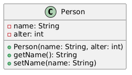
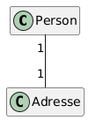
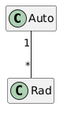
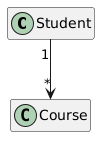
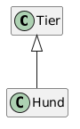
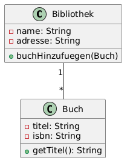

<!-- _class: lead -->

# 21 - UML
## POS - 1xHIF

---

## Agenda (1/2)

1. Was ist UML?
2. Klassendiagramm: Grundform
3. Sichtbarkeiten (Visibilitäten)
4. Assoziationen

---

## Agenda (2/3)

5. Multiplizitäten
6. Assoziationen in Java
7. Gerichtete Assoziation

---

## Agenda (3/3)

8. Vererbung (Generalisierung)
9. Vollständiges Beispiel: Bibliothek
10. Vom UML zum Code

---

## Lernziele

- Ich kann die Notation von Klassendiagrammen lesen
- Ich kann einfache UML-Klassendiagramme erstellen
- Ich kann Beziehungen zwischen Klassen modellieren

---

## Was ist UML?

UML = **U**nified **M**odeling **L**anguage

- Standardisierte Notation für Softwaredesign
- Visuelle Darstellung von Code-Strukturen
- Hilft beim Planen, Kommunizieren und Dokumentieren

<div class="highlight-box"><p>UML ist die gemeinsame Sprache zwischen Entwicklern!</p></div>

---

## Partneraktivität: Ein Klassendiagramm zeichnen

<div class="highlight-box">
<p>Euer Partner beschreibt ein einfaches System (z. B. «eine Bibliothek mit Büchern und Mitgliedern»). Ihr zeichnet das UML-Klassendiagramm auf Papier. Wechselt die Rollen. Vergleicht eure Diagramme — sind sie gleich?</p>
</div>

---

## Klassendiagramm: Grundform

Eine Klasse wird als Kasten mit drei Bereichen dargestellt:



---

## Sichtbarkeiten (Visibilitäten)

Jedes Attribut und jede Methode hat eine Sichtbarkeit:

| Symbol | Bedeutung | Java |
| --- | --- | --- |
| `+` | public | für alle sichtbar |
| `-` | private | nur in der Klasse |
| `#` | protected | nur in Subklassen |

```java
public class Person {
    private String name;   // - name
    public String getName() { ... }  // + getName()
}
```

---

## Assoziationen

Eine Assoziation zeigt eine Beziehung zwischen zwei Klassen.



Eine einfache Linie bedeutet: Person hat eine Adresse.

```java
public class Person {
    private Adresse adresse;  // Assoziation
}
```

---

## Multiplizitäten

Multiplizitäten geben an, wie viele Objekte beteiligt sind.



| Notation | Bedeutung |
| --- | --- |
| 1 | genau eines |
| * | beliebig viele (0..*) |
| 0..1 | optional (0 oder 1) |
| 1..* | mindestens eines |

---

## Assoziationen in Java

```java
public class Person {
    private Adresse adresse;
}

public class Auto {
    private Rad[] raeder = new Rad[4];
}

public class Bestellung {
    private Kunde kunde;  // kann null sein
}
```

---

## Gerichtete Assoziation

Ein Pfeil zeigt die Richtung der Beziehung an.



Ein Student besucht beliebig viele Kurse.

```java
public class Student {
    private Course[] kurse;
}

public class Course {
    // kennt seine Studenten nicht (keine Referenz)
}
```

---

## Vererbung (Generalisierung)

Ein Dreieck zeigt die Vererbung an.



```java
public class Tier { }
public class Hund extends Tier { }
```

---

## Vollständiges Beispiel: Bibliothek



```java
public class Bibliothek {
    private String name;
    private String adresse;
    private Buch[] buecher;

    public void buchHinzufuegen(Buch b) { ... }
}
```

---

## Vom UML zum Code

Schritte:

1. Jeder Kasten wird eine Klasse
2. Attribute werden zu Feldern (mit Typ)
3. Methoden werden zu Methoden (mit Rückgabetyp)
4. Assoziationen werden zu Referenzen
5. Multiplizitäten bestimmen Array oder einzelne Variable

---

## Zusammenfassung

- UML = Visuelle Darstellung von Code
- Klassendiagramm: Kasten mit Name, Attributen, Methoden
- Sichtbarkeiten: + (public), - (private), # (protected)
- Assoziationen = Referenzen im Code
- Multiplizitäten = 1, *, 0..1, 1..*

---

## Übungen

- **Exercise:** UML to Code (Student/Course)

---

## Jahresprojekt: Dungeon Crawler

<div class="highlight-box">
<p>Erstelle ein UML-Klassendiagramm des gesamten Dungeon Crawlers.</p>
</div>
