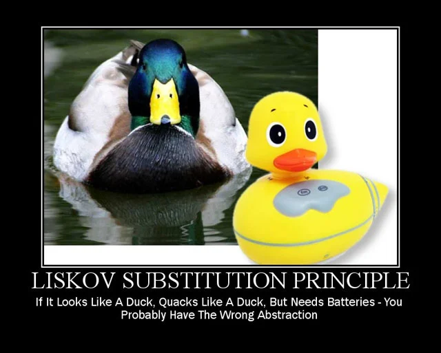

<!-- _class: lead -->

# 10 - Streams, Intermediate
## POS - 3xHIF

---

## Agenda (1/2)

1. Review: SOLID Recap
2. Review: From OOP to Functional
3. What is a Stream?
4. Stream Pipeline
5. filter
6. filter with Objects
7. map

---

## Agenda (2/2)

8. map with Method References
9. flatMap
10. flatMap Example: Words
11. forEach
12. reduce
13. reduce: Finding Max
14. Summary

---

## Learning Objectives

- I can explain what a Stream is and how lazy evaluation works
- I can use filter and map to transform collections declaratively
- I can use flatMap to flatten nested data structures
- I can use reduce to combine stream elements into a single value
- I can choose between loops and streams based on readability

---

## Review: SOLID Recap

- SRP: Single responsibility
- OCP: Open for extension, closed for modification
- LSP: Substitutable subtypes
- ISP: Focused interfaces
- DIP: Depend on abstractions

---

## Explain the joke



---

## Review: From OOP to Functional

- SOLID helps with object-oriented design
- Streams bring functional programming to Java
- Less boilerplate, more expressive code

---

## What is a Stream?

- A sequence of elements supporting sequential/parallel operations
- Not a data structure -- it processes data from a source
- Supports pipelining: chain operations together
- Lazy evaluation: intermediate ops are not executed until a terminal op is called

---

## Reflection: Streams vs. Loops

<div class="highlight-box">
<p>Do streams make code more readable or more cryptic? When would you prefer a traditional for-loop over a stream pipeline? Discuss with your neighbor: what makes a stream pipeline "good" vs. "over-engineered"?</p>
</div>

---

## Stream Pipeline

```java
List<String> result = list.stream()
    .filter(s -> s.startsWith("A"))
    .map(String::toUpperCase)
    .collect(Collectors.toList());
```

Source → Intermediate Operations → Terminal Operation

---

## filter

Selects elements that match a predicate.

```java
List<Integer> numbers = List.of(1, 2, 3, 4, 5, 6);

List<Integer> even = numbers.stream()
    .filter(n -> n % 2 == 0)
    .toList();

// Result: [2, 4, 6]
```

---

## filter with Objects

```java
List<Person> adults = people.stream()
    .filter(p -> p.age() >= 18)
    .toList();

List<Person> named = people.stream()
    .filter(p -> p.name() != null)
    .filter(p -> !p.name().isEmpty())
    .toList();
```

---

## Now Kata 1: Filter and Map

Write methods that use stream filter and map operations to transform and select data from collections.

---

## map

Transforms each element using a function.

```java
List<String> names = List.of("alice", "bob", "charlie");

List<String> upper = names.stream()
    .map(s -> s.substring(0, 1).toUpperCase() + s.substring(1))
    .toList();

// Result: ["Alice", "Bob", "Charlie"]
```

---

## map with Method References

```java
List<String> names = List.of("Alice", "Bob", "Charlie");

List<Integer> lengths = names.stream()
    .map(String::length)
    .toList();

// Result: [5, 3, 7]
```

---

## Now Kata 2: Advanced flatMap

Use flatMap on a nested School/Department/Teacher structure with Optional fields to extract and flatten data.

---

## flatMap

Flattens nested structures into a single stream.

```java
List<List<Integer>> nested = List.of(
    List.of(1, 2), List.of(3, 4), List.of(5, 6)
);

List<Integer> flat = nested.stream()
    .flatMap(List::stream)
    .toList();

// Result: [1, 2, 3, 4, 5, 6]
```

---

## flatMap Example: Words

```java
List<String> sentences = List.of(
    "Hello world", "Java streams"
);

List<String> words = sentences.stream()
    .flatMap(s -> Arrays.stream(s.split(" ")))
    .toList();

// Result: ["Hello", "world", "Java", "streams"]
```

---

## Now Kata 3: flatMap Nested Collections

Flatten lists of lists, extract words from sentences, and get unique characters using flatMap.

---

## forEach

Performs an action on each element (terminal operation).

```java
List<String> names = List.of("Alice", "Bob", "Charlie");
names.stream()
    .filter(n -> n.length() > 3)
    .forEach(System.out::println);
```

<div class="highlight-box">
<p>Prefer toList() over forEach for collecting results!</p>
</div>

---

## Now Kata 4: Stream Pipeline with Peek

Debug stream pipelines using peek() and a custom DebugCollector to inspect intermediate results.

---

## reduce

Combines all elements into a single value.

```java
List<Integer> numbers = List.of(1, 2, 3, 4, 5);

int sum = numbers.stream()
    .reduce(0, (a, b) -> a + b);

int product = numbers.stream()
    .reduce(1, (a, b) -> a * b);

// sum = 15, product = 120
```

---

## reduce: Finding Max

```java
List<Integer> numbers = List.of(3, 7, 2, 9, 5);

Optional<Integer> max = numbers.stream()
    .reduce(Integer::max);

max.ifPresent(System.out::println); // 9
```

---

## Now Kata 5: reduce Pipeline

Use reduce for sum of lengths, longest string, factorial, and concatenation with a custom delimiter.

---

## Summary

- Streams enable declarative data processing
- Intermediate ops: filter, map, flatMap
- Terminal ops: forEach, reduce, collect
- Lazy evaluation makes pipelines efficient
