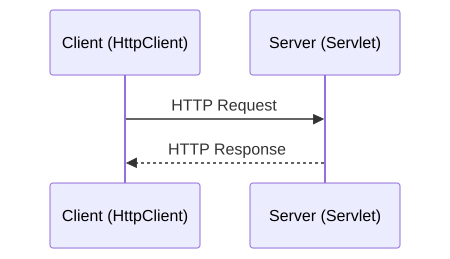

<!-- _class: lead -->

# 16 - Servlets, Basics
## POS - 3xHIF

---

## Agenda (1/2)

1. Review: HTTP & REST
2. From Client to Server
3. What is a Servlet?
4. Jakarta Servlet API
5. HttpServlet Lifecycle
6. HttpServletRequest
7. HttpServletResponse
8. Maven Setup

---

## Agenda (2/2)

9. Embedded Tomcat Server
10. Registering a Servlet
11. First Servlet: doGet
12. Reading Query Parameters
13. doPost: Receiving Data
14. Writing JSON Responses
15. Routing Without a Framework

---

## Learning Objectives

- I can explain what a Servlet is and how it fits into a Servlet container
- I can start an embedded Tomcat server from a main method
- I can register servlets programmatically and map them to URL paths
- I can read request data using HttpServletRequest
- I can write responses with status codes and content types using HttpServletResponse

---

## Review: HTTP & REST

- HTTP is a stateless request-response protocol
- Methods: GET, POST, PUT, DELETE for CRUD
- Status codes: 200, 201, 400, 404, 500
- REST uses resource-oriented URIs (/api/users)

---

## From Client to Server (1/2)

- Last week: we built HTTP clients with HttpClient
- Now: we build the server side ourselves
- We use the bare-bone Servlet API — no framework

---

## From Client to Server (2/2)



---

## What is a Servlet?

- A Java class that handles HTTP requests
- Part of the Jakarta Servlet specification
- Runs inside a Servlet Container (e.g., Tomcat)
- The foundation of every Java web framework

---

## Reflection: Why do all Java web frameworks build on Servlets?

<div class="highlight-box">
<p>What does it mean to build an abstraction layer? Why not write directly against raw TCP sockets?</p>
</div>

---

## Jakarta Servlet API

- `jakarta.servlet.*` (not `javax.servlet`)
- Tomcat 10+ uses the Jakarta namespace
- Key classes: `HttpServlet`, `HttpServletRequest`, `HttpServletResponse`

<div class="highlight-box">
<p>Spring Boot, Javalin, and all Java web frameworks build on top of Servlets.</p>
</div>

---

## HttpServlet Lifecycle

```java
public class MyServlet extends HttpServlet {
    @Override
    public void init() { /* called once on startup */ }

    @Override
    protected void doGet(HttpServletRequest req,
                         HttpServletResponse resp) { }

    @Override
    protected void doPost(HttpServletRequest req,
                          HttpServletResponse resp) { }
}
```

---

## HttpServletRequest

- `getParameter("name")` — query / form params
- `getHeader("Content-Type")` — request headers
- `getReader()` — raw request body
- `getPathInfo()` — path after servlet mapping
- `getMethod()` — GET, POST, PUT, DELETE

---

## HttpServletResponse

- `setStatus(200)` — HTTP status code
- `setContentType("application/json")`
- `getWriter()` — write text body
- `getOutputStream()` — write binary body
- `setHeader("Location", uri)` — response headers

---

## Maven Setup

Embedded Tomcat dependency for `pom.xml`:

```xml
<dependency>
    <groupId>org.apache.tomcat.embed</groupId>
    <artifactId>tomcat-embed-core</artifactId>
    <version>10.1.28</version>
</dependency>
```

---

## Embedded Tomcat Server

```java
import org.apache.catalina.startup.Tomcat;

public class App {
    public static void main(String[] args) throws Exception {
        var tomcat = new Tomcat();
        tomcat.setPort(8080);
        tomcat.getConnector();
        tomcat.start();
        tomcat.getServer().await();
    }
}
```

---

## Registering a Servlet

```java
var ctx = tomcat.addContext("", "/");
Tomcat.addServlet(ctx, "hello", new HelloServlet());
ctx.addServletMappingDecoded("/hello", "hello");
Tomcat.addServlet(ctx, "api", new ApiServlet());
ctx.addServletMappingDecoded("/api/*", "api");
```

<div class="highlight-box">
<p>Programmatic registration — no XML, no annotations needed.</p>
</div>

---

## First Servlet: doGet

```java
public class HelloServlet extends HttpServlet {
    @Override
    protected void doGet(HttpServletRequest req,
                         HttpServletResponse resp)
            throws IOException {
        resp.setContentType("text/plain");
        resp.setStatus(200);
        resp.getWriter().println("Hello, Servlets!");
    }
}
```

---

## Reading Query Parameters

```java
@Override
protected void doGet(HttpServletRequest req,
                     HttpServletResponse resp)
        throws IOException {
    var name = req.getParameter("name");
    if (name == null) name = "World";
    resp.setContentType("text/plain");
    resp.getWriter().println("Hello, " + name + "!");
}
```

Test: `curl http://localhost:8080/hello?name=Alice`

---

## doPost: Receiving Data

```java
@Override
protected void doPost(HttpServletRequest req,
                      HttpServletResponse resp)
        throws IOException {
    var body = req.getReader().lines()
        .reduce("", String::concat);
    resp.setContentType("text/plain");
    resp.getWriter().println("Received: " + body);
}
```

Test: `curl -d 'hello' http://localhost:8080/hello`

---

## Writing JSON Responses

```java
resp.setContentType("application/json");
resp.setCharacterEncoding("UTF-8");
resp.setStatus(201);
resp.getWriter().println(
    "{\"id\":1,\"title\":\"Learn Servlets\"}");
```

<div class="highlight-box">
<p>Set Content-Type before writing the body.</p>
</div>

---

## Routing Without a Framework

- One servlet per path prefix (`/api/todos/*`)
- Use `getPathInfo()` to distinguish sub-resources
- Use `getMethod()` to dispatch GET vs POST

```java
var path = req.getPathInfo(); // "/42"
var method = req.getMethod(); // "GET"
```

---

## Summary

- Servlets handle HTTP requests at the lowest level
- Embedded Tomcat starts from a plain main() method
- Request data via HttpServletRequest
- Response data via HttpServletResponse
- No framework — just the bare Servlet API
