<!-- _class: lead -->

# 25 - REST, Servlets, Front Controller
## POS - 3xHIF

---

## Agenda (1/2)

1. Review: Servlet Basics
2. The Problem: One Servlet Per Path
3. Front Controller Pattern
4. Front Controller Structure
5. Command Interface
6. Route Registration
7. Front Controller Servlet

---

## Agenda (2/2)

8. Path Variable Matching
9. JSON with Jackson
10. Serializing with ObjectMapper
11. Command: List Todos
12. Command: Create Todo
13. Structured Error Responses
14. Why Front Controller?

---

## Learning Objectives

- I can explain the Front Controller pattern and why it solves routing problems
- I can implement a Command interface for route handlers
- I can register routes and dispatch requests to the correct command
- I can use Jackson ObjectMapper for JSON serialization and deserialization
- I can implement path variable matching with regex patterns

---

## Review: Servlet Basics

- HttpServlet handles doGet, doPost, doPut, doDelete
- HttpServletRequest reads params, headers, body
- HttpServletResponse writes status, content-type, body
- Embedded Tomcat starts from a main() method

---

## The Problem: One Servlet Per Path

- Last week: one servlet per path prefix
- Path parsing with `getPathInfo()` is repetitive
- Each servlet re-does JSON parsing, error handling
- What if one servlet could route everything?

---

## Front Controller Pattern

<div class="highlight-box">
<p>A single servlet receives all requests and dispatches them to handlers.</p>
</div>

- One entry point for all HTTP requests
- Cross-cutting concerns handled once (logging, auth)
- Dispatches to Command objects based on path + method

---

## Reflection: How does Spring's DispatcherServlet work under the hood?

<div class="highlight-box">
<p>This pattern is exactly what Spring does. Why is it important to understand the underlying mechanism instead of just using annotations?</p>
</div>

---

## Front Controller Structure



---

## Command Interface

```java
public interface Command {
    void execute(HttpServletRequest req,
                 HttpServletResponse resp)
            throws Exception;
}
```

<div class="highlight-box">
<p>Each command handles one specific route + HTTP method.</p>
</div>

---

## Route Registration

```java
var routes = new HashMap<String, Command>();
routes.put("GET:/api/todos",     new ListTodosCmd(repo));
routes.put("POST:/api/todos",    new CreateTodoCmd(repo));
routes.put("GET:/api/todos/{id}", new GetTodoCmd(repo));
routes.put("DELETE:/api/todos/{id}", new DeleteTodoCmd(repo));
```

---

## Front Controller Servlet

```java
@Override
protected void service(HttpServletRequest req,
                       HttpServletResponse resp)
        throws ServletException, IOException {
    var key = req.getMethod() + ":" + req.getPathInfo();
    var cmd = routes.get(key);
    if (cmd == null) {
        resp.setStatus(404);
        return;
    }
    cmd.execute(req, resp);
}
```

---

## Path Variable Matching

- Routes like `/api/todos/{id}` need pattern matching
- Replace `{id}` with a regex group
- Store compiled patterns instead of exact strings

```java
var pattern = Pattern.compile("/api/todos/(\\d+)");
var matcher = pattern.matcher(req.getPathInfo());
if (matcher.matches()) {
    var id = Long.parseLong(matcher.group(1));
}
```

---

## JSON with Jackson

```xml
<dependency>
    <groupId>com.fasterxml.jackson.core</groupId>
    <artifactId>jackson-databind</artifactId>
    <version>2.17.0</version>
</dependency>
```

---

## Serializing with ObjectMapper

```java
var mapper = new ObjectMapper();

// Object → JSON
resp.setContentType("application/json");
mapper.writeValue(resp.getWriter(), todo);

// JSON → Object
var todo = mapper.readValue(req.getReader(), Todo.class);
```

---

## Command: List Todos

```java
public class ListTodosCmd implements Command {
    private final TodoRepository repo;
    public ListTodosCmd(TodoRepository repo) {
        this.repo = repo;
    }
    public void execute(HttpServletRequest req,
                         HttpServletResponse resp)
            throws Exception {
        resp.setContentType("application/json");
        new ObjectMapper().writeValue(
            resp.getWriter(), repo.findAll());
    }
}
```

---

## Command: Create Todo

```java
public class CreateTodoCmd implements Command {
    public void execute(HttpServletRequest req,
                         HttpServletResponse resp)
            throws Exception {
        var mapper = new ObjectMapper();
        var todo = mapper.readValue(req.getReader(), Todo.class);
        var saved = repo.save(todo);
        resp.setStatus(201);
        resp.setContentType("application/json");
        mapper.writeValue(resp.getWriter(), saved);
    }
}
```

---

## Structured Error Responses

```java
public record ErrorResponse(int status, String message) {}

try {
    cmd.execute(req, resp);
} catch (Exception e) {
    resp.setStatus(500);
    resp.setContentType("application/json");
    new ObjectMapper().writeValue(resp.getWriter(),
        new ErrorResponse(500, e.getMessage()));
}
```

---

## Why Front Controller?

- Single entry point → consistent error handling
- Commands are small, testable, single-purpose
- Adding a route = add a Command, no servlet config
- This is exactly how Spring's DispatcherServlet works

---

## Summary

- Front Controller: one servlet dispatches to Commands
- Command pattern: one class per route + method
- Jackson ObjectMapper for JSON ser/des
- Path variables via regex pattern matching
- Centralized error handling in the front controller
