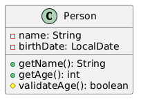
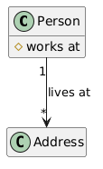
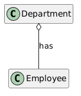
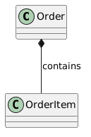
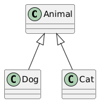
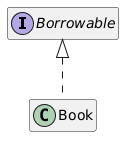
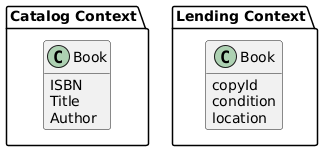

<!-- _class: lead -->

# 01 - UML & DDD
## POS - 4xHIF

---

## Wiederholung: UML Klassendiagramme

- Klasse: Rechteck mit Name, Attribute, Methoden
- `+` public, `-` private, `#` protected
- Beziehungen: Assoziation, Aggregation, Komposition, Vererbung

---

## Wiederholung: Sichtbarkeitsnotation



---

## Assoziation

- Strukturelle Beziehung zwischen Klassen
- "Hat-eine" oder "kennt-eine" Beziehung
- Kann haben: Multiplität, Rollenname, Navigierbarkeit



---

## Assoziation in Java

```java
public class Person {
    private Address address;  // association
}

public class Address {
    private String street;
    private String city;
}
```

Die Person "kennt" eine Address — aber Address hat ihren eigenen Lebenszyklus.

---

## Aggregation

- Spezialform der Assoziation — "hat-eine" mit *geteiltem* Besitz
- Das Kind kann unabhängig vom Elternteil existieren
- Wird mit **leerem Diamant** auf der Elternseite gezeichnet



---

## Aggregation Beispiel

```java
public class Department {
    private List<Employee> employees;  // aggregation
}

public class Employee {
    // Employee exists independently
    // even if Department is deleted
}
```

---

## Komposition

- Stärkere Form — "hat-eine" mit *exklusivem* Besitz
- Das Kind **kann** nicht ohne das Elternteil existieren
- Wird mit **gefülltem Diamant** auf der Elternseite gezeichnet
- Elternteil ist für den Lebenszyklus des Kindes verantwortlich



---

## Komposition Beispiel

```java
public class Order {
    private List<OrderItem> items;  // composition
    // items created with Order, destroyed with Order
}

public class OrderItem {
    // Cannot exist without an Order
}
```

---

## Aggregation vs. Komposition

| Merkmal | Aggregation | Komposition |
| --- | --- | --- |
| Besitz | Geteilt | Exklusiv |
| Lebenszyklus | Unabhängig | Abhängig vom Elternteil |
| Diamant | Leer (◊) | Gefüllt (◆) |
| Beispiel | Department + Employee | Order + OrderItem |

---

## Vererbung (Generalisierung)

- "Ist-eine" Beziehung — Pfeil mit **leerem Dreieck**
- Kind erbt alle nicht-private Mitglieder
- Java: `extends` für Klassen



---

## Realisierung (Interface)

- Gestrichelte Linie mit **leerem Dreieck**
- Klasse implementiert Interface
- Java: `implements`



---

## Was ist Domain-Driven Design?

- Software-Design Methode von Eric Evans (2003)
- Fokus auf die **Kerndomain** und Domänenlogik
- Software nach realen Geschäftskonzepten modellieren
- Brücke zwischen Domänenexperten und Entwicklern schlagen

---

## DDD: Schlüsselkonzepte

- **Ubiquitous Language** — gemeinsamer Wortschatz von Entwicklern UND Domänenexperten
- **Bounded Context** — explizite Grenze um ein Domänenmodell
- **Entities** — Objekte mit Identität (z.B. eine Person)
- **Value Objects** — Objekte definiert durch ihre Attribute (z.B. eine Adresse)

---

## Ubiquitous Language

- Keine Übersetzungsschichten: "Book", "Member", "Loan" im Code = gleiche Begriffe im Gespräch
- Technische Begriffe im Domänenmodell vermeiden
- Wenn das Team "ein Buch ausleihen" sagt, sollte der Code `checkOut(book, member)` haben

---

## Bounded Context

- Ein *Book* im "Catalog"-Kontext kann andere Attribute haben als im "Sales"-Kontext
- Jeder Kontext hat sein eigenes Modell und seine eigene Ubiquitous Language
- Kontexte kommunizieren über Events oder APIs



---

## Entities vs. Value Objects

| Entities | Value Objects |
| --- | --- |
| Haben Identität (id) | Keine Identität — definiert durch Attribute |
| Veränderbar | Unveränderlich |
| Gleichheit per id | Gleichheit per allen Attributen |
| Beispiel: Person, Order | Beispiel: Address, Money, Color |

---

## Was wir heute gelernt haben

- UML: Assoziation, Aggregation, Komposition, Vererbung
- DDD: Ubiquitous Language, Bounded Context
- Entities vs. Value Objects
- Wie man eine Domain für das Projekt bewertet
