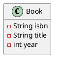

# Kata 1: PlantUML from Code

| Field | Value |
|-------|-------|
| Concepts | PlantUML, class diagram, relationships |
| Difficulty | 2/5 |
| Duration | approx. 20 min |

### Task

Write PlantUML code that generates a class diagram for the following entities:

- **Library** (name, address) manages Books and Members
- **Book** (isbn, title, year) has one Author, can have multiple Loans
- **Member** (memberId, name, email) can have multiple active Loans
- **Loan** (loanDate, returnDate) references one Book and one Member
- **Author** (name, biography) has written multiple Books

Include:
- All classes with attributes and their types
- Correct relationship types (association, aggregation, composition)
- Multiplicities (1, *, 0..1, etc.)

### Example PlantUML Snippet

### Extension

Add a `Magazine` class that inherits from a new abstract class `Item`.
