<!-- _class: lead -->

# 13 - Logging
## POS - 4xHIF

---

## Warum Logging?

- **Debugging** — Was passiert in der Produktion?
- **Monitoring** — Wie viele Requests, Fehler, Latenzen?
- **Auditing** — Wer hat was wann gemacht?
- **Fehleranalyse** — Warum ist der Request fehlgeschlagen?

<div class="highlight-box">
<p>System.out.println ist KEIN Logging!</p>
</div>

---

## System.out vs. Logging

|  | System.out | Logging (SLF4J) |
| --- | --- | --- |
| Levels | Nein | TRACE, DEBUG, INFO, WARN, ERROR |
| Konfigurierbar | Nein | Per Paket, per Profile |
| Format | Nur Text | Strukturiert (JSON, Pattern) |
| Ziel | Nur Konsole | Datei, DB, Elastic, ... |
| Performance | Langsam (+ concat) | Optimiert ({}) |

---

## SLF4J — Simple Logging Facade

- Abstraktionsschicht (Facade Pattern)
- Die Anwendung spricht nur mit SLF4J
- Die Implementierung (Logback, Log4j2, java.util.logging) wird zur Laufzeit eingebunden
- Wechsel der Implementierung ohne Code-Änderung

---

## Logback — Default in Spring Boot



Spring Boot bringt Logback mit — keine extra Dependency nötig.

---

## Log Levels

| Level | Bedeutung | Beispiel |
| --- | --- | --- |
| TRACE | Sehr detailliert | Methodeneintritt, Parameterwerte |
| DEBUG | Debug-Informationen | SQL-Statements, Zwischenergebnisse |
| INFO | Normale Betriebsinfo | App gestartet, Request empfangen |
| WARN | Warnung | Deprecated API, knapper Speicher |
| ERROR | Fehler | Datenbank nicht erreichbar, Exception |

Default-Level in Spring Boot: `INFO`

---

## Logger in Java

```java
import org.slf4j.Logger;
import org.slf4j.LoggerFactory;

@Service
public class LibraryService {

    private static final Logger log =
        LoggerFactory.getLogger(LibraryService.class);

    public Book createBook(CreateBookCommand command) {
        log.info("Creating book with ISBN: {}", command.isbn());

        if (bookRepository.findByIsbn(command.isbn()).isPresent()) {
            log.warn("Duplicate ISBN attempted: {}", command.isbn());
            throw new DuplicateIsbnException(command.isbn());
        }

        Book book = new Book(command.isbn(), command.title(), command.year());
        Book saved = bookRepository.save(book);
        log.debug("Book saved with id: {}", saved.getId());
        return saved;
    }
}
```

---

## Parameterized Logging

```java
// Schlecht: String-Konkatenation (auch wenn Level deaktiviert!)
log.debug("User " + user.getId() + " logged in from " + ip);

// Gut: Platzhalter (keine Kosten bei deaktiviertem Level)
log.debug("User {} logged in from {}", user.getId(), ip);

// Beliebig viele Platzhalter
log.info("Order {} by {}: {} items, total {}",
    orderId, customer, itemCount, total);

// Mit Throwable als letztem Parameter
log.error("Failed to process order {}", orderId, exception);
```

Platzhalter {} werden NUR ausgewertet, wenn das Level aktiv ist.

---

## Logging-Konfiguration in application.yml

```yaml
logging:
  level:
    root: INFO
    at.spengergasse: DEBUG          # Eigenes Projekt = DEBUG
    org.springframework: WARN        # Spring-Framework = WARN
    org.hibernate.SQL: DEBUG         # SQL-Statements sehen

  pattern:
    console: "%d{HH:mm:ss.SSS} [%thread] %-5level %logger{36} - %msg%n"
    file: "%d{yyyy-MM-dd HH:mm:ss} [%thread] %-5level %logger{36} - %msg%n"

  file:
    name: logs/application.log       # Datei-Logging aktivieren
    max-size: 10MB                   # Pro Datei maximal 10MB
    max-history: 7                   # 7 Tage aufbewahren
```

---

## Per-Profile Logging

```yaml
# application-dev.yml
logging:
  level:
    at.spengergasse: DEBUG
    org.hibernate.SQL: DEBUG
  pattern:
    console: "%d{HH:mm:ss.SSS} %-5level %logger{36} - %msg%n"
```

```yaml
# application-prod.yml
logging:
  level:
    at.spengergasse: WARN
  file:
    name: logs/app-prod.log
    max-size: 50MB
    max-history: 30
```

---

## logback-spring.xml

```xml
<configuration>
    <appender name="CONSOLE" class="ch.qos.logback.core.ConsoleAppender">
        <encoder>
            <pattern>%d{HH:mm:ss.SSS} [%thread] %-5level %logger{36} - %msg%n</pattern>
        </encoder>
    </appender>

    <appender name="FILE" class="ch.qos.logback.core.rolling.RollingFileAppender">
        <file>logs/app.log</file>
        <rollingPolicy class="ch.qos.logback.core.rolling.TimeBasedRollingPolicy">
            <fileNamePattern>logs/app.%d{yyyy-MM-dd}.log</fileNamePattern>
            <maxHistory>30</maxHistory>
        </rollingPolicy>
        <encoder>
            <pattern>%d{yyyy-MM-dd HH:mm:ss} [%thread] %-5level %logger{36} - %msg%n</pattern>
        </encoder>
    </appender>

    <springProfile name="dev">
        <root level="DEBUG">
            <appender-ref ref="CONSOLE"/>
        </root>
    </springProfile>

    <springProfile name="prod">
        <root level="INFO">
            <appender-ref ref="CONSOLE"/>
            <appender-ref ref="FILE"/>
        </root>
    </springProfile>
</configuration>
```

---

## Structured Logging (JSON)

```xml
<dependency>
    <groupId>net.logstash.logback</groupId>
    <artifactId>logstash-logback-encoder</artifactId>
    <version>9.0</version>
</dependency>
```

```xml
<appender name="JSON" class="ch.qos.logback.core.ConsoleAppender">
    <encoder class="net.logstash.logback.encoder.LogstashEncoder"/>
</appender>
```

```json
{
    "@timestamp": "2024-11-20T10:30:00.123+01:00",
    "level": "INFO",
    "logger": "at.spengergasse.LibraryService",
    "message": "Creating book with ISBN: 978-3-16-148410-0",
    "thread": "http-nio-8080-exec-3"
}
```

Ideal für Elasticsearch/Kibana (ELK-Stack).

---

<div class="highlight-box">
<h2>What We Learned Today</h2>
<ul>
<li>SLF4J als Logging-Facade, Logback als Implementierung</li>
<li>Log-Levels: TRACE, DEBUG, INFO, WARN, ERROR</li>
<li>Parameterized Logging mit {}</li>
<li>Konfiguration via application.yml und logback-spring.xml</li>
<li>Per-Profile Logging (dev = DEBUG, prod = INFO)</li>
</ul>
</div>
