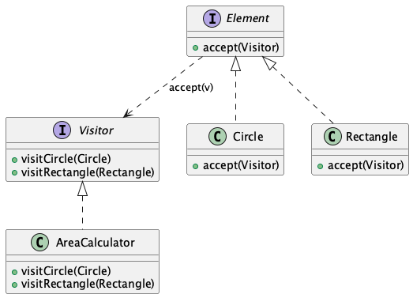

<!-- _class: lead -->

# 10 - Visitor Pattern
## POS - Advanced

---

## Agenda (1/2)

1. Problemstellung
2. Problemstellung - Beispiel
3. Visitor Pattern - Lösung
4. GoF Klassifikation
5. Struktur
6. Double Dispatch
7. Double Dispatch - Ablauf
8. Visitor Interface

---

## Agenda (2/2)

9. Element Interface
10. Konkrete Elemente
11. Konkreter Visitor - AreaCalculator
12. Konkreter Visitor - PerimeterCalculator
13. Client-Code
14. Vor- und Nachteile
15. Alternative: Pattern Matching (Java 21+)

---

## Lernziele

- Ich kann das Problem erklären, das das Visitor Pattern löst
- Ich kann Double Dispatch erklären und im Code umsetzen
- Ich kann Visitor- und Element-Interfaces implementieren
- Ich kann einen konkreten Visitor für eine Elementhierarchie schreiben
- Ich kenne Pattern Matching (Java 21+) als moderne Alternative zum Visitor Pattern

---

## Problemstellung

- Sie haben eine Objektstruktur mit verschiedenen Elementtypen (Circle, Rectangle, Triangle)
- Sie möchten Operationen wie Flächenberechnung, Umfangsberechnung, Zeichnen ausführen
- Problem: Jede neue Operation erfordert Änderungen an allen Elementklassen

---

## Problemstellung - Beispiel

```java
interface Shape {
    double area();           // neue Methode für jede Operation
    double perimeter();      // jede neue Operation = Änderung aller Klassen
    void draw();
}

class Circle implements Shape {
    // Muss area(), perimeter(), draw() implementieren
}

class Rectangle implements Shape {
    // Muss ebenfalls alle drei implementieren
}
```

Verstoss gegen das Open/Closed-Prinzip!

---

## Visitor Pattern - Lösung

<div class="highlight-box">
<p>Trenne die Operationen von der Objektstruktur.</p>
</div>

- Die Elementklassen bleiben stabil
- Neue Operationen = neue Visitor-Klassen
- Erfüllt das Open/Closed-Prinzip für Operationen

---

## GoF Klassifikation

- **Kategorie:** Behavioral Pattern (Verhaltensmuster)
- **Zweck:** Ermöglicht das Definieren neuer Operationen auf einer Objektstruktur, ohne die Klassen der Elemente zu ändern
- **Auch bekannt als:** Double Dispatch
- **Prinzip:** "Represent an operation to be performed on the elements of an object structure"

---

## Struktur



---

## Double Dispatch

- **Single Dispatch:** Java wählt die Methode basierend auf dem Laufzeittyp des Empfängers (this)
- **Double Dispatch:** Die Wahl der Methode hängt vom Laufzeittyp *beider* Objekte ab

```java
// Single Dispatch (normale Methoden)
shape.draw();  // nur shape bestimmt die Implementierung

// Double Dispatch (Visitor)
shape.accept(visitor);  // sowohl shape als auch visitor bestimmen
```

---

## Double Dispatch - Ablauf

```java
element.accept(visitor);
// 1. Aufruf: accept() auf element -> Dynamic Dispatch
// 2. Im accept(): visitor.visit(this) -> erneuter Dynamic Dispatch

class Circle implements Shape {
    public void accept(Visitor v) {
        v.visitCircle(this);  // this ist vom Typ Circle
    }
}
```

Zwei aufeinanderfolgende dynamische Dispatchs = Double Dispatch

---

## Visitor Interface

```java
public interface ShapeVisitor {
    void visitCircle(Circle circle);
    void visitRectangle(Rectangle rectangle);
}
```

- Eine visit-Methode pro konkreter Elementklasse
- Methodenname + Parameter-Typ bestimmen die Zuordnung

---

## Element Interface

```java
public interface Shape {
    double getArea();       // bestehende Methode
    void accept(ShapeVisitor visitor);  // NEU: Accept-Methode
}
```

- accept nimmt einen Visitor entgegen
- Ruft die passende visit-Methode des Visitors auf

---

## Konkrete Elemente

```java
class Circle implements Shape {
    private double radius;
    public Circle(double radius) { this.radius = radius; }
    public double getRadius() { return radius; }

    public double getArea() { return Math.PI * radius * radius; }
    public void accept(ShapeVisitor visitor) {
        visitor.visitCircle(this);  // this ist Circle
    }
}

class Rectangle implements Shape {
    private double width, height;
    public Rectangle(double w, double h) { this.width = w; this.height = h; }
    public double getWidth() { return width; }
    public double getHeight() { return height; }

    public double getArea() { return width * height; }
    public void accept(ShapeVisitor visitor) {
        visitor.visitRectangle(this);  // this ist Rectangle
    }
}
```

---

## Konkreter Visitor - AreaCalculator

```java
public class AreaCalculator implements ShapeVisitor {
    private double totalArea = 0;

    public void visitCircle(Circle c) {
        totalArea += Math.PI * c.getRadius() * c.getRadius();
    }

    public void visitRectangle(Rectangle r) {
        totalArea += r.getWidth() * r.getHeight();
    }

    public double getTotalArea() { return totalArea; }
}
```

---

## Konkreter Visitor - PerimeterCalculator

```java
public class PerimeterCalculator implements ShapeVisitor {
    private double totalPerimeter = 0;

    public void visitCircle(Circle c) {
        totalPerimeter += 2 * Math.PI * c.getRadius();
    }

    public void visitRectangle(Rectangle r) {
        totalPerimeter += 2 * (r.getWidth() + r.getHeight());
    }

    public double getTotalPerimeter() { return totalPerimeter; }
}
```

---

## Client-Code

```java
List<Shape> shapes = List.of(
    new Circle(5),
    new Rectangle(3, 4)
);

AreaCalculator areaCalc = new AreaCalculator();
PerimeterCalculator perimCalc = new PerimeterCalculator();

for (Shape s : shapes) {
    s.accept(areaCalc);    // double dispatch
    s.accept(perimCalc);   // double dispatch
}

System.out.println("Total area: " + areaCalc.getTotalArea());
System.out.println("Total perimeter: " + perimCalc.getTotalPerimeter());
```

---

## Vor- und Nachteile

Vorteile

Open/Closed-Prinzip: neue Operationen ohne Änderung der Elemente
Sammelt verwandte Operationen in einer Klasse
Visitor kann Zustand über die Traversierung hinweg speichern

Nachteile

Neue Elementklassen erfordern Änderung aller Visitor
Zirkulare Abhängigkeit zwischen Visitor und Elementhierarchie
Aufwandiger als einfaches Pattern Matching

---

## Alternative: Pattern Matching (Java 21+)

```java
double calculateArea(Shape shape) {
    return switch (shape) {
        case Circle c     -> Math.PI * c.getRadius() * c.getRadius();
        case Rectangle r  -> r.getWidth() * r.getHeight();
        default           -> throw new IllegalArgumentException();
    };
}
```

- Weniger Boilerplate-Code
- Keine separate Visitor-Hierarchie nötig
- Aber: Compiler warnt nicht bei neuen Elementtypen (weicht Open/Closed auf)

---

## Zusammenfassung

- Visitor = GoF Behavioral Pattern für Operationen auf heterogenen Strukturen
- Double Dispatch = zwei dynamische Methodenaufrufe hintereinander
- accept-Methode in jedem Element ruft visit-Methode des Visitors
- Neue Operationen = neue Visitor-Klasse (offen für Erweiterung)
- Neue Elemente = Änderung aller Visitor (geschlossen für Änderung)
