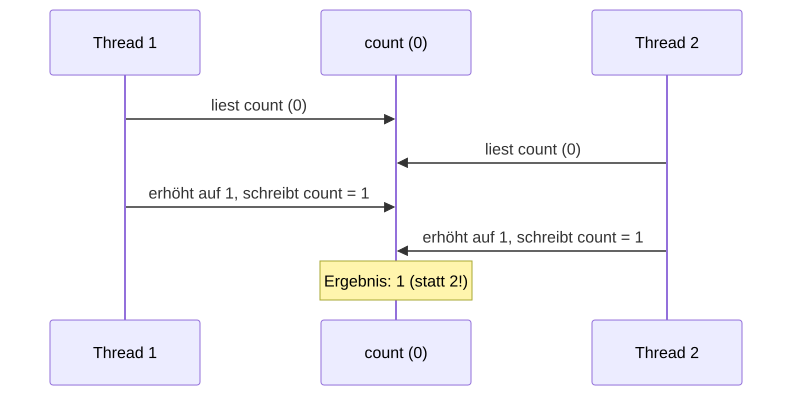
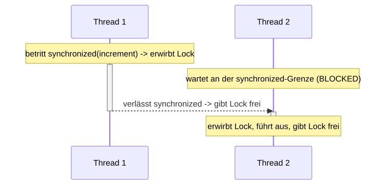

<!-- _class: lead -->

# 12 - Concurrency in Java - Introduction
## POS - Advanced

---

## Agenda (1/2)

1. Motivation
2. Prozesse vs. Threads
3. Thread-Erzeugung: extends Thread
4. Thread-Erzeugung: implements Runnable
5. Thread-Lebenszyklus
6. Race Conditions
7. Race Condition - Ablauf
8. Lösung: synchronized

---

## Agenda (2/2)

9. synchronized - Wirkung
10. volatile
11. Thread-Koordination: wait/notify
12. wait/notify - Regeln
13. Producer-Consumer Pattern
14. Deadlocks
15. Best Practices

---

## Lernziele

- Ich kenne den Unterschied zwischen Prozessen und Threads
- Ich kann Threads mit extends Thread und implements Runnable erzeugen
- Ich kann Race Conditions erklären und mit synchronized vermeiden
- Ich kenne den Unterschied zwischen synchronized und volatile
- Ich kann wait/notify für die Thread-Koordination einsetzen und Deadlocks vermeiden

---

## Motivation

- Moderne CPUs haben mehrere Kerne — echte Parallelitat möglich
- Nebenläufigkeit verbessert Durchsatz und Responsivität
- Beispiele: Webserver (viele Clients gleichzeitig), UI-Apps (Hintergrundthreads), Big Data
- Aber: Nebenläufigkeit ist fehleranfällig (Race Conditions, Deadlocks)

---

## Prozesse vs. Threads

Prozess

Eigener Adressraum, eigene Ressourcen
Schwergewichtiger Kontextwechsel
Isolation zwischen Prozessen

Thread

Teilt Adressraum mit anderen Threads
Leichtgewichtiger Kontextwechsel
Direkter Speicherzugriff über gemeinsame Variablen

---

## Thread-Erzeugung: extends Thread

```java
class MyThread extends Thread {
    private final String name;
    MyThread(String name) { this.name = name; }

    @Override
    public void run() {
        for (int i = 0; i < 5; i++)
            System.out.println(name + ": " + i);
    }
}

Thread t1 = new MyThread("Thread-A");
Thread t2 = new MyThread("Thread-B");
t1.start();  // startet neuen Thread
t2.start();
```

- Nachteil: Kann keine andere Klasse erweitern (keine Mehrfachvererbung)

---

## Thread-Erzeugung: implements Runnable

```java
class MyTask implements Runnable {
    private final String name;
    MyTask(String name) { this.name = name; }

    @Override
    public void run() {
        for (int i = 0; i < 5; i++)
            System.out.println(name + ": " + i);
    }
}

Thread t1 = new Thread(new MyTask("Task-A"));
Thread t2 = new Thread(new MyTask("Task-B"));
t1.start();
t2.start();
```

- Vorteil: Klasse kann andere Klasse erweitern
- Bevorzugter Ansatz (Trennung von Task und Thread)

---

## Thread-Lebenszyklus



- **NEW:** erzeugt, noch nicht gestartet
- **RUNNABLE:** bereit zur Ausführung (im Scheduler)
- **BLOCKED/WAITING:** wartet auf Monitor oder Bedingung
- **TERMINATED:** run() ist beendet

---

## Race Conditions

```java
class Counter {
    private int count = 0;

    public void increment() { count++; }  // nicht atomar!

    public int getCount() { return count; }
}

// Zwei Threads rufen gleichzeitig increment() auf
Counter counter = new Counter();

// Thread 1: count++
// Thread 2: count++
// Resultat kann 1 statt 2 sein!
```

<div class="highlight-box">
<p>count++ ist nicht atomar: lesen + erhohen + schreiben (3 Schritte!)</p>
</div>

---

## Race Condition - Ablauf



Ursache: Gleichzeitiger Zugriff auf gemeinsamen Zustand ohne Synchronisation

---

## Lösung: synchronized

```java
class SynchronizedCounter {
    private int count = 0;

    public synchronized void increment() {
        count++;  // Jetzt atomar aus Sicht der Threads
    }

    public synchronized int getCount() {
        return count;
    }
}

// Oder als Block:
public void increment() {
    synchronized (this) {
        count++;
    }
}
```

- synchronized stellt gegenseitigen Ausschluss (Mutual Exclusion) sicher
- Jedes Objekt in Java hat einen intrinsischen Lock (Monitor)

---

## synchronized - Wirkung



- Nur ein Thread kann gleichzeitig in einem synchronized-Block auf demselben Objekt sein
- Andere Threads müssen warten (BLOCKED-Zustand)

---

## volatile

```java
class FlagHolder {
    private volatile boolean running = true;

    public void stop() { running = false; }

    public void run() {
        while (running) {
            // tue etwas
        }
    }
}
```

- **Problem ohne volatile:** Thread könnte running im CPU-Cache puffern (nie die Änderung sehen)
- **volatile:** Schreibzugriff wird sofort in den Hauptspeicher geschrieben, Lesezugriff liest aus Hauptspeicher
- Lost das Sichtbarkeitsproblem, aber NICHT das Atomaritatsproblem

---

## Thread-Koordination: wait/notify

```java
class BoundedBuffer {
    private final int[] buffer;
    private int count = 0, putIndex = 0, takeIndex = 0;

    public BoundedBuffer(int capacity) {
        buffer = new int[capacity];
    }

    public synchronized void put(int value) throws InterruptedException {
        while (count == buffer.length) {
            wait();  // Puffer voll -> warten
        }
        buffer[putIndex] = value;
        putIndex = (putIndex + 1) % buffer.length;
        count++;
        notifyAll();  // Konsument benachrichtigen
    }

    public synchronized int take() throws InterruptedException {
        while (count == 0) {
            wait();  // Puffer leer -> warten
        }
        int value = buffer[takeIndex];
        takeIndex = (takeIndex + 1) % buffer.length;
        count--;
        notifyAll();  // Produzent benachrichtigen
        return value;
    }
}
```

---

## wait/notify - Regeln

- **wait()** muss in synchronized-Block aufgerufen werden
- **wait()** gibt den Monitor-Lock frei und wartet
- **notify()** weckt einen wartenden Thread
- **notifyAll()** weckt alle wartenden Threads
- **Immer in einer while-Schleife warten!** (Spurious Wakeups)

---

## Producer-Consumer Pattern

```java
// Produzent-Thread
class Producer implements Runnable {
    private final BoundedBuffer buffer;
    // ...
    public void run() {
        for (int i = 0; i < 100; i++) {
            buffer.put(i);
            System.out.println("Produziert: " + i);
        }
    }
}

// Konsument-Thread
class Consumer implements Runnable {
    private final BoundedBuffer buffer;
    // ...
    public void run() {
        for (int i = 0; i < 100; i++) {
            int value = buffer.take();
            System.out.println("Konsumiert: " + value);
        }
    }
}
```

---

## Deadlocks

```java
// Thread 1
synchronized (lockA) {
    synchronized (lockB) {
        // tue etwas
    }
}

// Thread 2
synchronized (lockB) {
    synchronized (lockA) {
        // tue etwas
    }
}
```

<div class="highlight-box">
<p>Vermeidung: Immer Locks in derselben Reihenfolge anfordern!</p>
</div>

---

## Best Practices

- **Runnable bevorzugen** statt Thread zu erweitern
- **Synchronisation so klein wie möglich** halten (Performance)
- **wait() immer in while-Schleife** (Spurious Wakeups)
- **Immer notifyAll() statt notify()** verwenden (Signalverlust vermeiden)
- **Geteilte mutable State minimieren** — bessere Alternative: immutable Objekte
- **Thread-Interrupts ordentlich behandeln** (InterruptedException)

---

## Zusammenfassung

- Thread-Erzeugung: extends Thread oder implements Runnable
- Race Conditions: Gleichzeitiger Zugriff auf shared mutable State
- synchronized: Gegenseitiger Ausschluss (Lock auf Objekt)
- volatile: Sichtbarkeit von Variablen (keine Atomaritat)
- wait/notify: Koordination zwischen Threads (Producer-Consumer)
- Deadlocks durch konsistente Lock-Reihenfolge vermeiden
