<!-- _class: lead -->

# 17 - Version Control
## POS - Advanced

---

## Agenda (1/2)

1. Motivation — Warum Versionsverwaltung?
2. Was ist Git?
3. Grundkonzepte
4. Git konfigurieren
5. Repository erstellen
6. Die drei Zustände

---

## Agenda (2/2)

7. Erste Schritte: add & commit
8. Status & History anzeigen
9. Änderungen vergleichen
10. Dateien verschieben & löschen
11. .gitignore — Dateien ausschließen
12. Änderungen rückgängig machen

---

## Lernziele

- Ich kann Git konfigurieren und ein Repository erstellen
- Ich kenne die drei Zustände (modified, staged, committed)
- Ich kann Änderungen committen, vergleichen und in der History nachvollziehen
- Ich kann .gitignore einsetzen und Änderungen rückgängig machen

---

## Motivation — Warum Versionsverwaltung?

- Änderungen an Code nachvollziehbar dokumentieren
- Zu jedem früheren Stand zurückkehren können
- Parallelarbeit im Team ohne Chaos
- Experimentieren ohne Risiko (Branches)
- Backup & verteilte Zusammenarbeit

<div class="highlight-box">
<p>Ohne VCS ist Softwareentwicklung auf Team-Ebene kaum möglich</p>
</div>

---

## Was ist Git?

- **Verteiltes** Version Control System (DVCS)
- Jeder Entwickler hat das **komplette Repository** lokal
- Entwickelt von Linus Torvalds (2005) für den Linux-Kernel
- De-facto-Standard in der Softwareentwicklung



---

## Grundkonzepte

- **Repository:** Enthält die gesamte Projekt-Historie
- **Working Tree:** Deine aktuell ausgecheckten Dateien
- **Commit:** Ein Snapshot des Projekts zu einem Zeitpunkt
- **SHA-1 Hash:** Jeder Commit hat eine eindeutige ID (z. B. `a1b2c3d`)
- **HEAD:** Zeiger auf den aktuellen Commit (den du ausgecheckt hast)

---

## Git konfigurieren

```bash
# Name und E-Mail (wichtig für Commits!)
git config --global user.name "Max Mustermann"
git config --global user.email "max@example.com"

# Editor festlegen
git config --global core.editor "code --wait"

# Konfiguration anzeigen
git config --list
```

- `--global` = für deinen gesamten Rechner
- `--local` = nur für ein Repository

---

## Repository erstellen

```bash
# Neues Projekt initialisieren
mkdir mein-projekt
cd mein-projekt
git init

# Oder bestehendes Projekt
cd bestehendes-projekt
git init
```

- `git init` erstellt ein verstecktes Verzeichnis `.git/`
- Alle Versionierungsdaten liegen in `.git/`
- Löschen von `.git/` macht das Repository rückgängig

---

## Die drei Zustände


- **Modified:** Datei wurde geändert, aber noch nicht zum Commit vorgemerkt
- **Staged:** Änderung ist für den nächsten Commit vorgemerkt
- **Committed:** Änderung ist dauerhaft in der Historie gespeichert

---

## Erste Schritte: add & commit

```bash
# Datei erstellen
echo "Hello World" > readme.txt

# Datei zum Staging hinzufügen
git add readme.txt

# Commit erstellen (mit Nachricht -m)
git commit -m "Initialer Commit: readme.txt"

# Alle Änderungen auf einmal
git add -A
git commit -m "Alle Dateien auf einmal committed"
```

- `git add` verschiebt modified → staged
- `git commit` verschiebt staged → committed (dauerhaft)
- Commit-Nachrichten sollten aussagekräftig sein!

---

## Status & History anzeigen

```bash
# Status des Working Tree
git status

# Kompakte History (eine Zeile pro Commit)
git log --oneline

# Graphische Darstellung
git log --oneline --graph --all
```

<div class="highlight-box">
<p><code>git status</code> ist der wichtigste Befehl — zeigt, was gerade los ist!</p>
</div>

---

## Änderungen vergleichen

```bash
# Ungestagede Änderungen anzeigen
git diff

# Gestagede vs. letzter Commit
git diff --staged

# Zwei Commits vergleichen
git log --oneline
git diff abc123 def456
```

```diff
diff --git a/readme.txt b/readme.txt
--- a/readme.txt
+++ b/readme.txt
@@ -1 +1,2 @@
 Hello World
+Zeile 2
```

---

## Dateien verschieben & löschen

```bash
# Datei umbenennen
git mv readme.txt README.md

# Datei löschen
git rm alte-datei.txt

# Nur aus Git entfernen (lokal behalten)
git rm --cached versehentlich.txt
```

- `git mv` = `mv + git add + git rm` (alles in einem Schritt)
- `git rm` löscht die Datei und staged die Löschung
- `--cached` entfernt eine Datei aus dem Tracking, ohne sie zu löschen

---

## .gitignore — Dateien ausschließen

```bash
# .gitignore anlegen
echo ".class" > .gitignore
echo "*.log" >> .gitignore
echo "build/" >> .gitignore
echo ".idea/" >> .gitignore

git add .gitignore
git commit -m "Gitignore hinzugefügt"
```

- **Weglassen:** Kompilierte Dateien (`.class`, `.jar`), IDE-Konfiguration, Build-Ordner
- Muster: `*.log`, `build/`, `config.local.*`
- Bereits getrackte Dateien werden durch .gitignore nicht ignoriert!

---

## Änderungen rückgängig machen

```bash
git restore readme.txt
git restore --staged readme.txt
git reset --hard HEAD
git revert HEAD
```

<div class="highlight-box">
<p><code>git reset --hard</code> löscht ungesicherte Änderungen — nicht rückgängig machbar!</p>
</div>

---

## Zusammenfassung

- Git ist ein **verteiltes** VCS — jeder hat das vollständige Repository
- Drei Zustände: **modified → staged → committed**
- `git init`, `git add`, `git commit` — der grundlegende Workflow
- `git status`, `git log`, `git diff` — den Zustand verstehen
- `.gitignore` hält das Repository sauber
- `git restore` / `git reset` / `git revert` — Änderungen rückgängig machen
