<!-- _class: lead -->

# 19 - Git Collaboration
## POS - Advanced

---

## Agenda (1/2)

1. Remote-Repositories — Konzept
2. Remote-Grundbefehle
3. git clone — Repository kopieren
4. git pull — Änderungen übernehmen
5. Pull Requests — Konzept
6. Pull Requests — Ablauf
7. Pull Requests — Beispiel
8. Code Review — Autor:innen
9. Code Review — Reviewer

---

## Agenda (2/2)

10. Branching-Strategien — Überblick
11. GitFlow — Architektur
12. GitFlow — Branches
13. GitFlow — Arbeitsablauf
14. GitHub Flow — Einfach & Effizient
15. Forking-Workflow
16. Forking — Beispiel
17. Git in CI/CD
18. CI/CD — Beispiel

---

## Lernziele

- Ich kann mit Remote-Repositories arbeiten (clone, pull, push)
- Ich kenne den Ablauf eines Pull Requests inklusive Code Review
- Ich kann GitFlow und GitHub Flow als Branching-Strategien unterscheiden
- Ich kenne den Forking-Workflow für externe Beiträge
- Ich verstehe die Rolle von Git in CI/CD-Pipelines

---

## Remote-Repositories — Konzept

- **Remote:** Eine Kopie des Repositories auf einem anderen Rechner/Server
- Ermöglicht synchronisierte Teamarbeit
- Typische Dienste: GitHub, GitLab, Bitbucket, Gitea
- Standard-Name für das Haupt-Remote: `origin`



---

## Remote-Grundbefehle

```bash
# Repository kopieren
git clone https://github.com/benutzer/projekt.git

# Änderungen holen (ohne zu mergen)
git fetch origin

# Änderungen holen & mergen
git pull origin main

# Lokale Commits hochladen
git push origin main
```

- `fetch` holt Daten, `pull` = fetch + merge
- `push` überträgt lokale Commits zum Remote

---

## git clone — Repository kopieren

```bash
# Vollständige lokale Kopie erstellen
git clone https://github.com/beispiel/projekt.git
cd projekt
```

- Nach `git clone` ist `origin` automatisch als Remote gesetzt
- `origin/main` ist der Remote-Tracking-Branch (nicht direkt bearbeitbar)

---

## git pull — Änderungen übernehmen

```bash
# Kurzform: holen & mergen
git pull origin main

# Mit Kontrolle: erst holen, dann mergen
git fetch origin
git log --oneline main..origin/main
git merge origin/main
```

- Fetch + Log gibt Kontrolle, bevor gemergt wird

---

## Pull Requests — Konzept

- **Pull Request (PR) / Merge Request (MR):** Bitte, Änderungen in einen anderen Branch zu übernehmen
- PRs ermöglichen **Code Review** vor dem Merge

---

## Pull Requests — Ablauf

1. Branch für Feature erstellen
2. Änderungen committen & pushen
3. PR auf GitHub/GitLab öffnen (feature → main)
4. Teamkollegen reviewen den Code
5. PR wird gemergt (oder abgelehnt)

---

## Pull Requests — Beispiel

```bash
git switch -c feature/login
git add -A && git commit -m "Login hinzugefügt"
git push origin feature/login
git switch main
git pull origin main
```

<div class="highlight-box">
<p>PRs sind kein Git-Feature, sondern eine Funktion der Plattform (GitHub/GitLab)</p>
</div>

---

## Code Review — Autor:innen

- Kleine, fokussierte PRs (max. 200-300 Zeilen)
- Aussagekräftige PR-Beschreibung (Was? Warum? Wie getestet?)
- Auf Feedback eingehen & nachbessern

---

## Code Review — Reviewer

- Konstruktives Feedback (nicht die Person kritisieren)
- Auf Architektur, Sicherheit, Testabdeckung achten
- Bei Unklarheiten nachfragen statt raten
- Typische PR-Checks: CI-Pipelines, Linting, automatisierte Tests

---

## Branching-Strategien — Überblick

| Strategie | Komplexität | Anwendung |
| --- | --- | --- |
| GitFlow | Hoch | Große Projekte, Release-Zyklen |
| GitHub Flow | Niedrig | Continuous Delivery, Web-Apps |
| Trunk-Based | Niedrig | CI/CD, kurze Feature-Branches |
| GitLab Flow | Mittel | Umgebungs-basierte Deployments |
| Forking | Mittel | Open Source, externe Beiträge |

---

## GitFlow — Architektur



---

## GitFlow — Branches

- **main:** Produktionsreifer Code (jeder Commit = Release)
- **develop:** Integrationsbranch für die nächste Version
- **feature/*:** Neue Features (werden in develop gemergt)
- **release/*:** Vorbereitung eines Releases (Bugfixes, Metadaten)
- **hotfix/*:** Dringende Bugfixes für die Produktion

---

## GitFlow — Arbeitsablauf

```bash
# 1. Feature entwickeln
git switch -c feature/neues-feature develop
# ... Arbeit ...
git push origin feature/neues-feature
# PR feature/neues-feature → develop

# 2. Release vorbereiten
git switch -c release/1.2.0 develop
# Letzte Anpassungen (Version, Changelog)
git push origin release/1.2.0
# PR release/1.2.0 → main  (+ zurück nach develop)

# 3. Hotfix
git switch -c hotfix/1.2.1 main
# Bugfix
git push origin hotfix/1.2.1
# PR hotfix/1.2.1 → main  (+ zurück nach develop)
```

---

## GitHub Flow — Einfach & Effizient

- Nur **ein** Haupt-Branch: `main`
- Jedes Feature/ jeder Fix: Branch von main → PR zurück zu main
- Nach Merge: Sofort deployen (Continuous Delivery)



1. Branch von main
2. Commits
3. PR öffnen (early!)
4. Review & Diskussion
5. Merge & Deploy

---

## Forking-Workflow

- Fork = persönliche Kopie eines fremden Repositories auf dem Server
- Typisch für Open Source: Externe können nicht direkt pushen

---

## Forking — Beispiel

```bash
git clone https://github.com/DEIN-USER/projekt.git
cd projekt
git remote add upstream https://github.com/ORIGINAL/projekt.git
git switch -c feature/xyz
# ... Änderungen ...
git push origin feature/xyz
git fetch upstream
git merge upstream/main
```

---

## Git in CI/CD

- CI/CD-Pipelines nutzen Git als Trigger und Informationsquelle
- Typische CI-Ereignisse: `push`, `pull_request`, `tag`
- `$GIT_COMMIT` — aktueller Commit-SHA
- `$GIT_BRANCH` — aktueller Branch-Name
- `$GIT_TAG_NAME` — Tag-Name (bei Tag-Ereignissen)

---

## CI/CD — Beispiel

```yaml
on:
  push:
    branches: [main]
  pull_request:
    branches: [main]

jobs:
  build:
    runs-on: ubuntu-latest
    steps:
      - uses: actions/checkout@v4
      - run: ./gradlew build
```

---

## Zusammenfassung

- **Remote-Repos:** `clone`, `fetch`, `pull`, `push`
- **Pull Requests:** Code Review vor dem Merge
- **GitFlow:** Strukturierte Branches (main, develop, feature, release, hotfix)
- **GitHub Flow:** Einfach — ein Haupt-Branch + PRs
- **Forking:** Externe Beiträge ohne direkten Schreibzugriff
- **CI/CD:** Git als Grundlage für automatisierte Builds & Deployments
